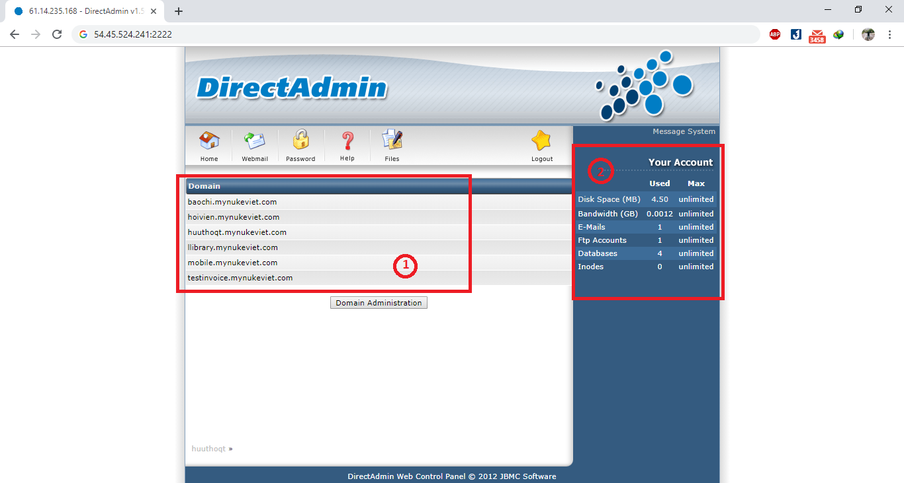
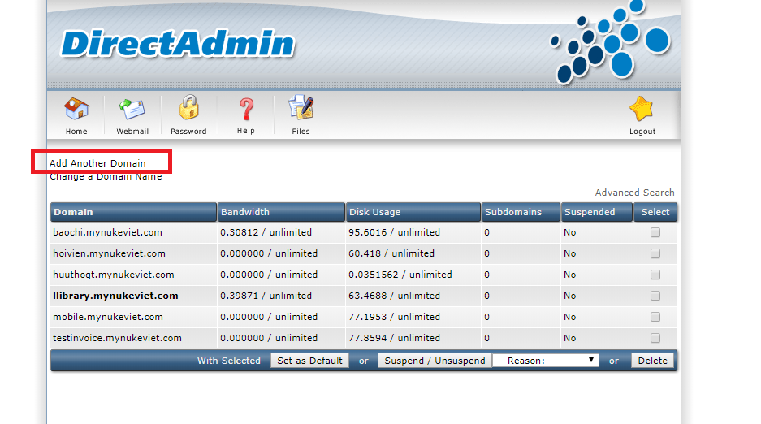

## Đăng nhập, đăng xuất

### Đăng nhập

Truy cập vào địa chỉ trang quản trị (địa chỉ và tài khoản đăng nhập được nhà cung cấp dịch vụ), (Ví dụ: http://32.23.924.524:2222/ hoặc tên miền http://tenmiencuaban:2222/).

- Sau khi đăng nhập chúng ta sẽ thấy giao diện như sau.

 

| STT | Thông tin | Mô tả |
|-----|-----------|-------|
| 1 | Danh sách các tên miền | Hiển thị danh sách các tên miền đang họat động tại hosting |
| 2 | Thông tin hosting | Các thông số về hosting |

### Đăng xuất

- Để đăng xuất người dùng click vào biểu tượng ngôi sao như trong hình để đăng xuất tài khoản.

 

##Quản lý tên miền

- Từ giao diện chính người dùng click vào button **Domain Administration** để vào phần quản lý tên miền.

 

###Thêm tên miền mới

- Khi người dùng vào trang quản lý tên miền, người dùng chọn mục **Add Another Domain** để thêm tên miền mới.

 

- Tại giao diện thêm tên miền, người dùng điền các thông tin cài đặt và chọn **Create** để hoàn thành việc tạo tên miền.

 

| STT | Thông tin | Mô tả |
|-----|-----------|-------|
| 1 | Domain | Người dùng nhập tên miền |
| 2 | Bandwidth | Hiển thị thông tin băng thông của tên miền, do hệ thống quy định |
| 3 | Disk Space | Là dung lượng lưu trữ của tên miền |
| 4 | Secure SSL | SSL là viết tắt của từ Secure Sockets Layer. Đây là một tiêu chuẩn an ninh công nghệ toàn cầu tạo ra một liên kết giữa máy chủ web và trình duyệt. |	

###Xóa tên miền

Để xóa một tên miền, người dùng chọn domain cần xóa và chọn **Delete**.

 

##Quản lý database

###Thêm database

- Từ giao diện chính, truy cập vào domain cần tạo database, sau đó người dùng chọn **MySQL Management** để vào trang quản lý database. Sau khi vào trang quản lý database người dùng chọn **Create new Database** .

- Điền đầy đủ thông tin và chọn create để hoàn thành tạo database.

###Xóa database

Ở giao diện chính quản lý database người dùng chọn database cần xóa và chọn tấc vụ **delete**.

##Upload, sửa, xóa file, thư mục
- Từ giao diện chính người dùng chọn domain chứa thư mục muốn truy cập, và chọn **File Manager**, **File Manager** là thư mục chứa các tập tin thực thi để chạy website.

- Để uploads file người dùng truy cập như sau: **"domains/tên doamin/public_html/"**

###Upload file 

- Trong giao diện quản lý file, người dùng chọn tác vụ upload file để thực thi việc upload file. 

- Người dùng chọn file cần upload và chọn **Upload File**.

**Chú ý: Khi upload file người dùng cần nén nhiều file thành 1 file zip. Khi upload file thành công người dùng cần thực hiện chmod những thư mục nào cần thiết**.

### 3.2. Sửa, xóa file

Để sửa hoặc xóa file, người dùng chọn file và chọn tác vụ xóa hoặc sửa theo ý người dùng mong muốn.

##Sao lưu dữ liệu

- Từ giao diện chính người dùng chọn tên miền muốn sao lưu, chọn **Create/Restore Backups**
- Tại giao diện sau lưu, người dùng chọn những thông tin cần thiết và chọn **Backup**.

- Khi backup xong người dùng sẽ nhận được thông báo backup xong.

- Để xem file đã backup người dùng vào mục **File manager** và truy cập vào thư mục **backups**. Những file mà người dùng đã backup sẽ hiển thị ở đây.

##Phục hồi dữ liệu

- Từ giao diện chính người dùng chọn tên miền muốn phục hồi, chọn **Create/Restore Backups**. Để phục hồi người dùng cần chọn file phục hồi và chọn **Restore Selected Items**.

**Chú ý: Khi file phục hồi là file mà người dùng đã backup từ trước**.
