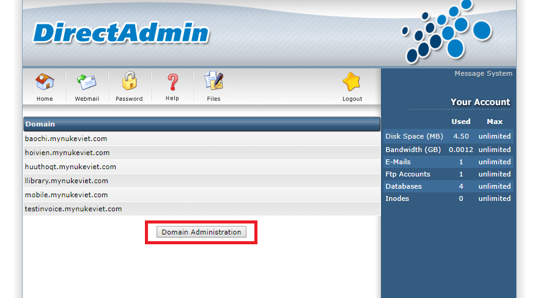

## Đăng nhập, đăng xuất tài khoản

### Đăng nhập

- Sau khi đăng ký tài khoản và có thông tin tài khoản người dùng tiến hành đăng nhập, để đăng nhập người dùng cần truy cập vào địa chỉ trang quản trị, địa chỉ này khi đăng ksy tài khoản thành công sẽ được gửi về cho người dùng ( ví dụ: http://32.23.924.524:2222/ hoặc tên miền đã được trỏ tới server hosting như http://tenmiencuaban:2222/).

 

- Sau khi đăng nhập chúng ta sẽ thấy giao diện như sau.

 

| STT | Thông tin | Mô tả |
|-----|-----------|-------|
| 1 | Thông tin domain | Hiển thị tất cả các thông tin domain. |
| 2 | Thôn tin tài khoản | Chứa thông tin tài khoản và các thông số tài khoản. |

### Đăng xuất

- Để đăng xuất người dùng click vào biểu tượng ngôi sao như trong hình để đăng xuất tài khoản.

 

## 1. Làm việc với domain

- Từ giao diện chính người dùng click vào button **Domain Administration** để vào phần quản lý domain.

 

### 1.1. Tạo domain mới

- Khi người dùng vào trang quản lý domain, người dùng chọn mục **Add Another Domain** để thêm domain.

 

- Sau khi người dùng chọn mục **Add Another Domain** trang thêm domain sẽ xuất hiện, người dùng điền các thông tin cài đặt và chọn **Create** để hoàn thành việc tạo domain.

 

| STT | Thông tin | Mô tả |
|-----|-----------|-------|
| 1 | Domain | Người dùng nhập tên domain. |
| 2 | Bandwidth | Độ rộng băng thông của domain. |
| 3 | Disk Space | Là dung lượng lưu trữ của domain. |
| 4 | Secure SSL | SSL là viết tắt của từ Secure Sockets Layer. Đây là một tiêu chuẩn an ninh công nghệ toàn cầu tạo ra một liên kết giữa máy chủ web và trình duyệt. |	

### 1.2. Xóa domain

- Để xóa một domain người dùng chọn domain cần xóa và chọn **delete**.

 

## 2. Làm việc với database
### 2.1. Thêm database
- Từ giao diện chính, truy cập vào domain cần tạo database, sau đó người dùng chọn **MySQL Management** để vào trang quản lý database. Sau khi vào trang quản lý database người dùng chọn **Create new Database** .

- Điền đầy đủ thông tin và chọn create để hoàn thành tạo database.

### 2.2. Xóa database
- Ở giao diện chính quản lý database người dùng chọn database cần xóa và chọn tấc vụ **delete**.

  

## 3. Upload, sửa, xóa file, thư mục
- Từ giao diện chính người dùng chọn domain chứa thư mục muốn truy cập, và chọn **File Manager**, **File Manager** là thư mục chứa các tập tin thực thi để chạy website.

- Để uploads file người dùng truy cập như sau: **"domains/tên doamin/public_html/"**

### 3.1. Upload file 
- Trong giao diện quản lý file, người dùng chọn tác vụ upload file để thực thi việc upload file. 

- Người dùng chọn file cần upload và chọn **Upload File**.

**Chú ý: Khi upload file người dùng cần nén nhiều file thành 1 file zip. Khi upload file thành công người dùng cần thực hiện chmod những thư mục nào cần thiết**.

### 3.2. Sửa, xóa file

- Để sửa hoặc xóa file, người dùng chọn file và chọn tác vụ xóa hoặc sửa theo ý người dùng mong muốn.

## 4. Sao lưu
- Từ giao diện chính người dùng chọn domain chứa thư mục muốn truy cập, và chọn **Create/Restore Backups** để tạo create và backup.

- Sau khi chọn **Create/Restore Backups** người dùng chọn những thông tin cần thiết và chọn **backup**.

- Khi backup xong người dùng sẽ nhận được thông báo backup xong.

- Để xem file đã backup người dùng vào mục **File manager** và truy cập vào thư mục **backups**. Những file mà người dùng đã backup sẽ hiển thị ở đây.

## 5. Phục hồi
- Từ giao diện chính người dùng chọn domain chứa thư mục muốn truy cập, và chọn **Create/Restore Backups**. Để phục hồi người dùng cần chọn file phục hồi và chọn **Restore Selected Items**.

**Chú ý: Khi file phục hồi là file mà người dùng đã backup từ trước**.
