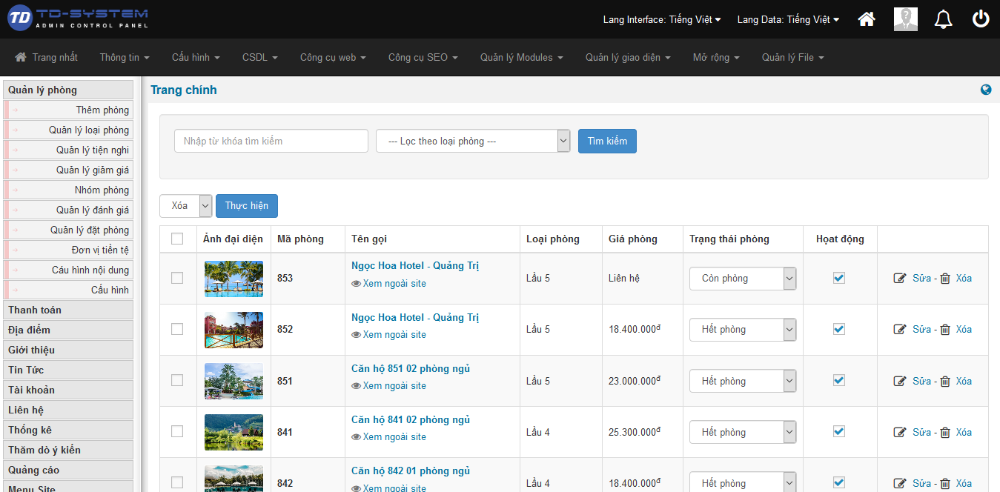
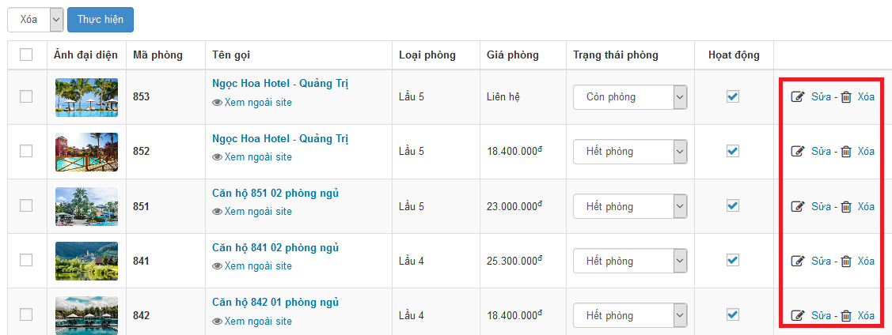
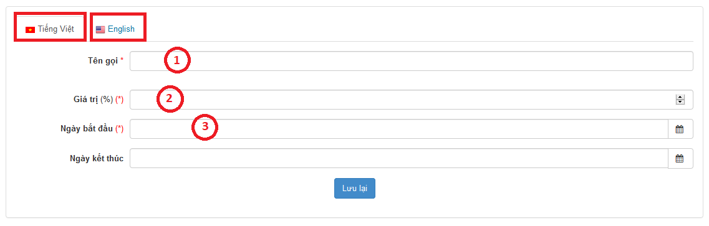

## 1. Quản lý phòng
### 1.1. Hiển thị danh sách phòng
Từ giao diện chính truy cập vào mục Quản lý phòng, ta sẽ thấy danh sách thông tin các phòng được hiển thị.

 

### 1.2. Tìm kiếm thông tin phòng
Để tìm kiếm thông tin phòng người dùng có thể tìm kiếm theo từ khóa hoặc lọc theo loại phòng. 

 

Sau khi nhập thông tin người dùng bấm tìm kiếm, thông tin tìm kiếm sẽ hiển thị dưới danh sách.

### 1.3. Sửa, xóa thông tin phòng

Để sửa thông tin phòng, trên danh sách, bạn chọn liên kết Sửa, ở cuối dòng. Tương tự cho việc Xóa

 

Để xóa nhiều thông tin phòng cùng 1 lúc người dùng tick vào checkbox đầu thông tin phòng và chọn lênh xóa và bấm thực hiện.

 

### 1.4. Trạng thái phòng và tình trạng phòng

Mục trạng thái phòng hiển thị trạng thái hết phòng hoặc còn phòng hoặc tự động, để chọn trạng thái người dùng chọn trạng thái cần chọn.
Mục hoạt động hiển thị phòng còn hoạt động hay không để chỉnh sửa hoạt động người dùng chọn checkbox để thay đổi.

 

Để chắc chắn việc thay đổi người dùng chọn **"OK"** và ngược lại nếu không chọn **"Cancel"**

 

### 1.5. Thêm phòng
Từ giao diện chính, truy cập menu Quản lý phòng (1) / Thêm phòng (2) 

 

Trong giao diện tiếp theo, bạn điền đầy đủ các trường thông tin, sau đó nhấn Lưu lại ở cuối trang để hoàn tất. 
**( Lưu ý thông tin tiếng việt nhập ngôn ngữ tiếng việt, tiếng anh nhập ngôn ngữ tiếng anh )**

 
 
 

## 2. Quản lý loại phòng
### 2.1. Hiển thị thông tin loại phòng
Từ giao diện chính, truy cập menu Quản lý phòng (1) / Quản lý loại phòng (2) 

### 2.2. Thêm thông tin loại phòng
Trong giao diện tiếp theo, bạn điền đầy đủ các trường thông tin, sau đó nhấn Lưu lại ở cuối trang để hoàn tất. 

**( Lưu ý thông tin tiếng việt nhập ngôn ngữ tiếng việt, tiếng anh nhập ngôn ngữ tiếng anh )**

### 2.3. Sửa, xóa thông tin loại phòng
Để sửa thông tin loại phòng, trên danh sách, bạn chọn liên kết Sửa, ở cuối dòng. Tương tự cho việc Xóa

### 2.4. Tùy chỉnh tác vụ thông tin loại phòng

| STT | Thông tin | Mô tả |
|-----|-----------|-------|
| 1 | Vị trí | Chọn vị trí để thể hiện trên danh sách |
| 2 | Hiển thị trang chủ | Chọn có hoặc không để thể hiện trên trang chủ |
| 3 | Cách thể hiện loại sản phẩm | chọn cách thể hiện để thể hiện sản phẩm ngoài trang chủ |
| 4 | Số liên kết | Chọn số liên kết cho loại phòng|
| 5 | Hoạt động | Chọn checkbox để chỉnh sửa thông tin sản phẩm |

## 3. Quản lý tiện nghi
Từ giao diện chính, truy cập menu Quản lý phòng (1) / Quản lý tiện nghi (2)
 

### 3.1. Thêm tiện nghi
Trong giao dưới đây, bạn điền đầy đủ các trường thông tin, sau đó nhấn Lưu lại ở cuối trang để hoàn tất. 

### 3.2. Sửa, xóa thông tin tiện nghi

Để sửa thông tin tiện nghi, trên danh sách, bạn chọn liên kết Sửa, ở cuối dòng. Tương tự cho việc Xóa

### 3.3. Tùy chỉnh tác vụ tiện nghi

| STT | Thông tin | Mô tả |
|-----|-----------|-------|
| 1 | Vị trí | Chọn vị trí để thể hiện trên danh sách |
| 2 | Chọn mặc định khi thêm | Chọn có hoặc không để thể hiện khi thêm|
| 3 | Hoạt động | Chọn checkbox để chỉnh sửa thông tin tiện nghi |

### 3.4. Tìm kiếm tiện nghi

Để tìm kiếm thông tin tiện nghi người dùng có thể nhập từ khóa và bấm tìm kiếm, thông tin tìm kiếm sẽ hiện ra dưới bảng.
 
 

## 4. Quản lý giảm giá
Từ giao diện chính, truy cập menu Quản lý phòng (1) / Quản lý giảm giá (2)
 

### 4.1. Thêm giảm giá
Trong giao diện dưới đây, bạn điền đầy đủ các trường thông tin, sau đó nhấn Lưu lại ở cuối trang để hoàn tất lưu lại thông tin giảm giá. 

**Chú ý: những thông tin bắt buộc nhập người dùng phải nhập đầy đủ**

### 4.2. Sửa, xóa thông tin giảm giá

Để sửa thông tin giảm giá, trên danh sách, bạn chọn liên kết Sửa, ở cuối dòng. Tương tự cho việc Xóa

Chỉnh sửa thông tin hoạt động người dùng chọn checkbox để điều chỉnh trạng thái còn hoạt động hay không.

### 4.3. Tìm kiếm thông tin giảm giá

Để tìm kiếm thông tin giảm giá người dùng có thể nhập từ khóa và bấm tìm kiếm, thông tin tìm kiếm sẽ hiện ra dưới bảng.

## 5. Quản lý nhóm phòng
Từ giao diện chính, truy cập menu Quản lý phòng (1) / Quản lý nhóm phòng (2)
 

### 5.1. Thêm nhóm phòng
Trong giao diện dưới đây, bạn điền đầy đủ các trường thông tin, sau đó nhấn Lưu lại ở cuối trang để hoàn tất lưu lại thông tin nhóm phòng. 

**Chú ý: những thông tin bắt buộc nhập người dùng phải nhập đầy đủ**

### 5.2. Sửa, xóa thông tin nhóm phòng

Để sửa thông tin nhóm phòng, trên danh sách, bạn chọn liên kết Sửa, ở cuối dòng. Tương tự cho việc Xóa

Chỉnh sửa thông tin chọn mặc định khi thêm. Nếu chọn có khi thêm phòng mặc định mục chọn sẽ được tick vào checkbox và ngược lại.

## 6. Quản lý đánh giá
## 7. Quản lý đặt phòng
## 8. Đơn vị tiền tệ
## 9. Cấu hình nội dung
## 10. Cấu hình

## 100. Trang chủ website

Khi đến với trang chủ website khách hàng sẽ thấy ngay mục tìm kiếm thông tin loại phòng.

 

Phía dưới mục tìm kiếm thông tin phòng là 2 mục gợi ý **"Căn hộ đề xuất"** và **"Căn hộ mới"**.

### 1.1. Tìm kiếm thông tin phòng

