## Ngôn ngữ hệ thống

Hệ thống quản lý sẽ có 2 mục ngôn ngữ đó là:

- **Lang interface**:
Lang interface chỉ thể hiện ngôn ngữ của hệ thống nhưng không thể hiện ngôn ngữ của module. 

- **Lang data**:
Lang data thể hiện ngôn ngữ data mà người dùng chọn của những module có ngôn ngữ đó, những module không có ngôn ngữ data giống người dùng chọn sẽ không hiển thị được.
Khi chọn ngôn ngữ data thì mặc định những mục trong module sẽ thay đổi ngôn ngữ giống người dùng chọn lang data.

## 1. Quản lý phòng
### 1.1. Hiển thị danh sách phòng
Từ giao diện chính truy cập vào mục Quản lý phòng, người dùng sẽ thấy danh sách thông tin các phòng được hiển thị.

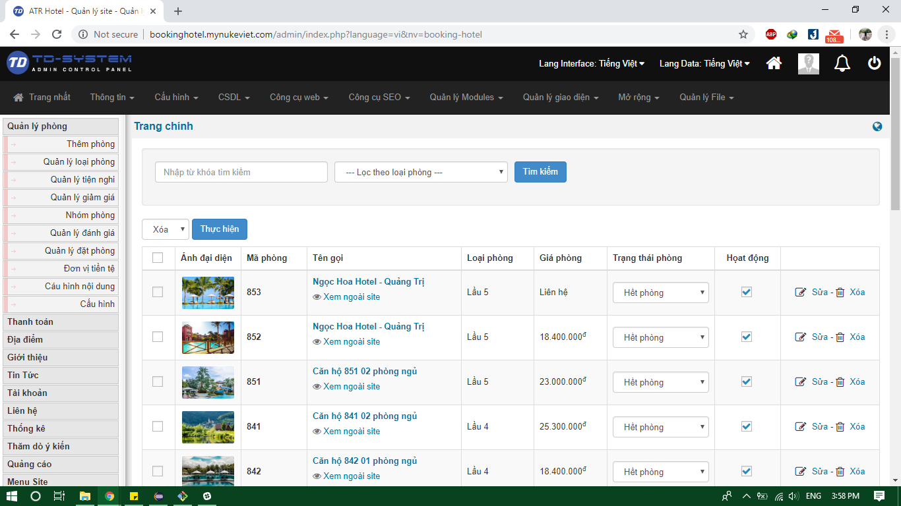 

Ở giao diện hiển thị ở phần tên gọi khi người dùng click vào tên phòng sẽ hiện ra thông tin chi tiết phòng ở trong site, người dùng click vào xem ngoài site thì thông tin ngoài site sẽ được hiện ra.

 

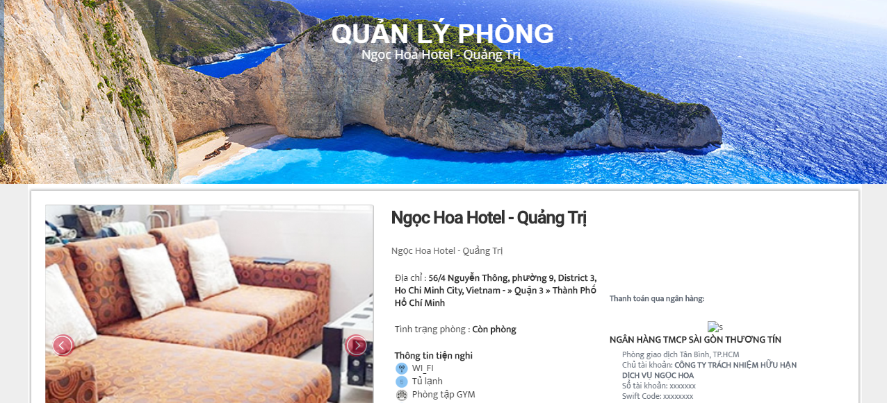 

### 1.2. Tìm kiếm thông tin phòng
Để tìm kiếm thông tin phòng người dùng có thể tìm kiếm theo từ khóa hoặc lọc theo loại phòng. 

 

Sau khi nhập thông tin người dùng chọn tìm kiếm, thông tin tìm kiếm sẽ hiển thị dưới danh sách.

### 1.3. Sửa, xóa thông tin phòng

Để sửa thông tin phòng, trên danh sách, bạn chọn liên kết sửa, ở cuối dòng. Tương tự cho việc Xóa.

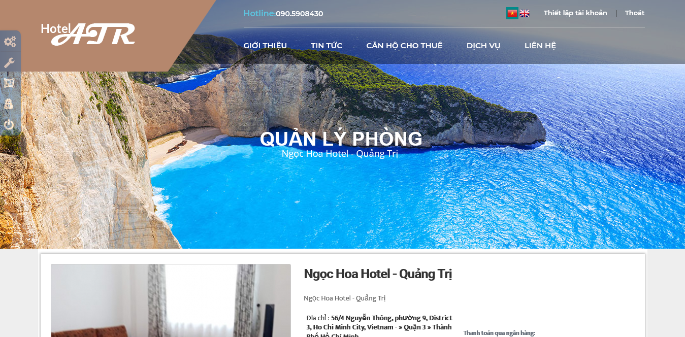 

Để xóa nhiều thông tin phòng cùng 1 lúc người dùng tick vào checkbox đầu thông tin phòng và chọn lênh xóa và bấm thực hiện.

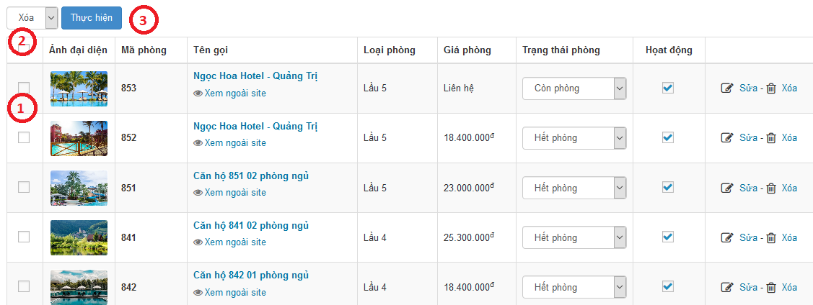 

### 1.4. Trạng thái phòng và hoạt động phòng
Mục trạng thái phòng là trạng thái khi đặt phòng.

Trạng thái Tự động: Khi khách đặt phòng và xác nhận thanh toán thì hệ thống sẽ thông báo phòng đã hết, các ngày đã thanh toán của phòng sẽ được ẩn đi và không chọn được,
Còn phòng: Phòng luôn còn, kể cả khách trước đã thanh toán thì khách sau vẫn đặt và thanh toán được.
Hết phòng: Phòng sẽ bị khóa chức năng đặt phòng.

Mục hoạt động hiển thị trạng thái hoạt động của phòng.

 

Để chắc chắn việc thay đổi người dùng chọn **"OK"** và ngược lại nếu không chọn **"Cancel"**.

 

### 1.5. Thêm phòng
Từ giao diện chính, truy cập menu Quản lý phòng (1) / Thêm phòng (2) 

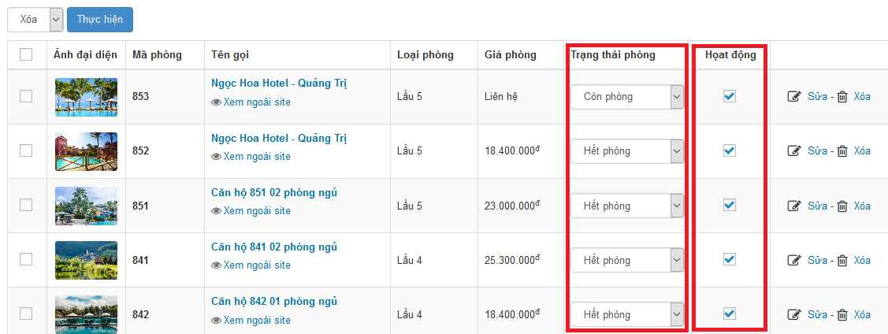 

Trong giao diện tiếp theo, bạn điền đầy đủ các trường thông tin, sau đó nhấn Lưu lại ở cuối trang để hoàn tất. 

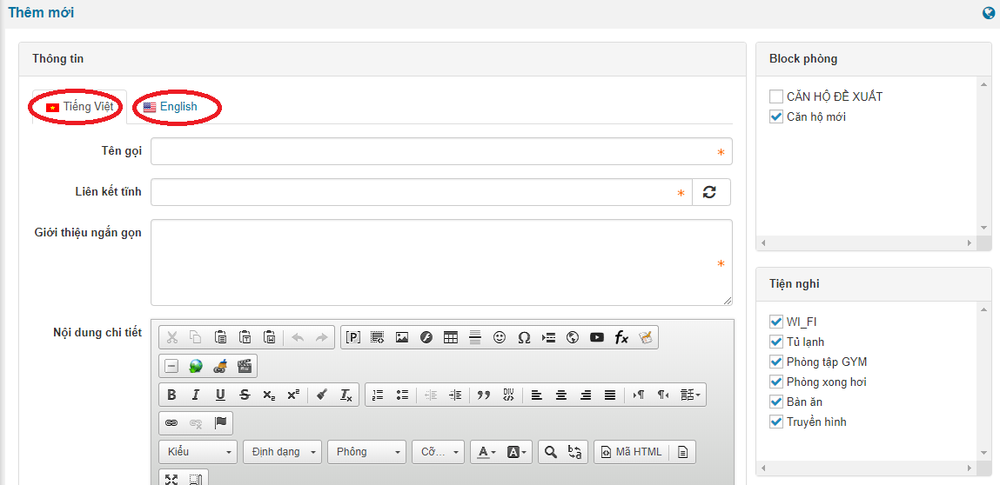 
 
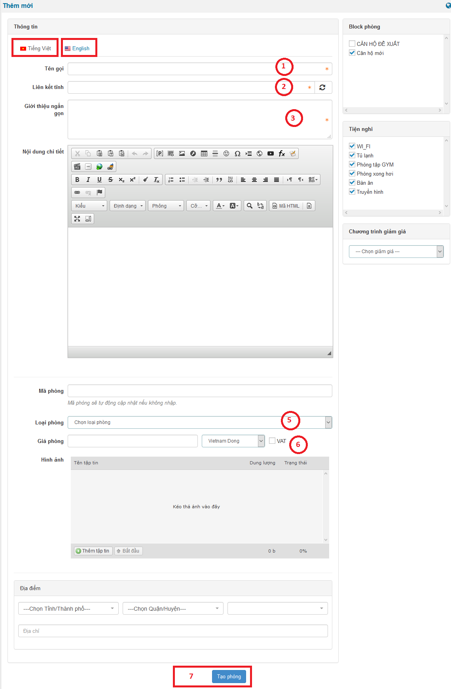 

- Mục block phòng sẽ chọn từ nhóm phòng.
- Mục tiện nghi sẽ lấy thông tin từ quản lý tiện nghi.
- Mục chương trình giảm giá sẽ lấy thông tin quản lý mã giảm giá.
- Mục loại phòng sẽ lấy thông tin nhóm quản lý loại phòng.
- Giá phòng chọn loại giá theo cấu hình đơn vị tiền tệ, hệ thống sẽ tự động chuyển đổi thành giá ở ngôn ngữ hiện tại.

**Chú ý: những thông tin (*) bắt buộc nhập người dùng phải nhập đầy đủ, thông tin tiếng việt nhập ngôn ngữ tiếng việt, tiếng anh nhập ngôn ngữ tiếng anh**.
## 2. Quản lý loại phòng
### 2.1. Hiển thị thông tin loại phòng
Từ giao diện chính, truy cập menu Quản lý phòng (1) / Quản lý loại phòng (2).

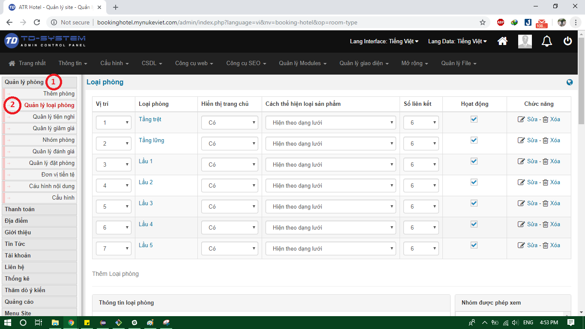

### 2.2. Thêm thông tin loại phòng
Trong giao diện tiếp theo, bạn điền đầy đủ các trường thông tin, sau đó nhấn Lưu lại ở cuối trang để hoàn tất. 

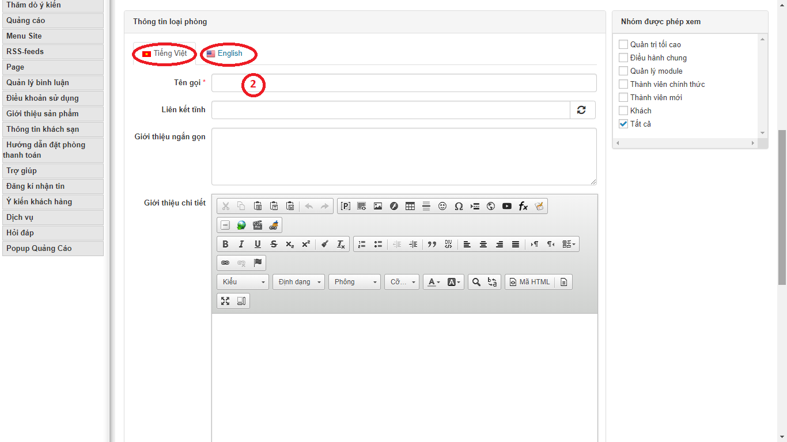

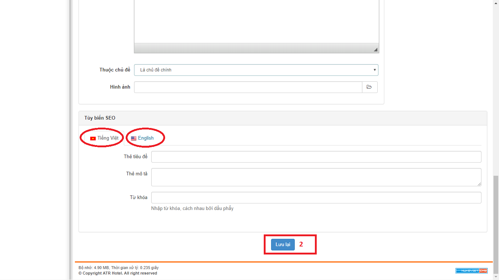

- Nhóm được phép xem chỉ định nhóm đó được xem loại phòng khi thêm vào.

**Chú ý: những thông tin (*) bắt buộc nhập người dùng phải nhập đầy đủ, thông tin tiếng việt nhập ngôn ngữ tiếng việt, tiếng anh nhập ngôn ngữ tiếng anh**.

### 2.3. Sửa, xóa thông tin loại phòng
Để sửa thông tin loại phòng, trên danh sách, bạn chọn liên kết Sửa, ở cuối dòng. Tương tự cho việc Xóa.

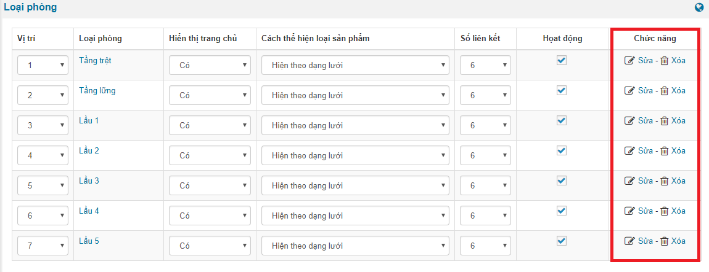

### 2.4. Tùy chỉnh tác vụ thông tin loại phòng

| STT | Thông tin | Mô tả |
|-----|-----------|-------|
| 1 | Vị trí | Chọn vị trí để sắp xếp, hể hiện trên danh sách |
| 2 | Hiển thị trang chủ | Chọn có hoặc không để thể hiện trên trang chủ |
| 3 | Cách thể hiện loại sản phẩm | chọn cách thể hiện để thể hiện sản phẩm ngoài trang chủ |
| 4 | Số liên kết | Chọn số liên kết cho loại phòng|
| 5 | Hoạt động | Chọn checkbox để chỉnh sửa thông tin sản phẩm |

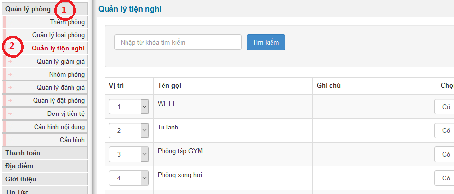

## 3. Quản lý tiện nghi
Từ giao diện chính, truy cập menu Quản lý phòng (1) / Quản lý tiện nghi (2).
 
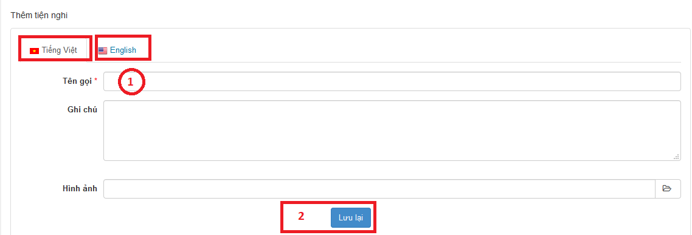

### 3.1. Thêm tiện nghi
Trong giao diện dưới đây, bạn điền đầy đủ các trường thông tin, sau đó nhấn Lưu lại ở cuối trang để hoàn tất. 

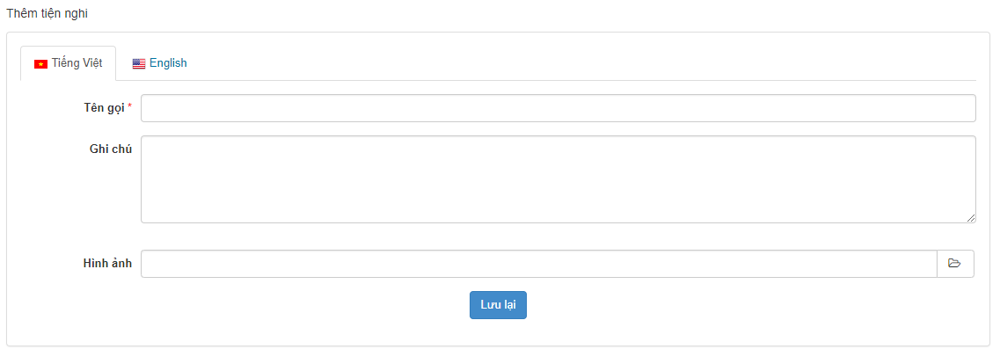

**Chú ý: những thông tin (*) bắt buộc nhập người dùng phải nhập đầy đủ, thông tin tiếng việt nhập ngôn ngữ tiếng việt, tiếng anh nhập ngôn ngữ tiếng anh**.

### 3.2. Sửa, xóa thông tin tiện nghi

Để sửa thông tin tiện nghi, trên danh sách, bạn chọn liên kết Sửa, ở cuối dòng. Tương tự cho việc Xóa.

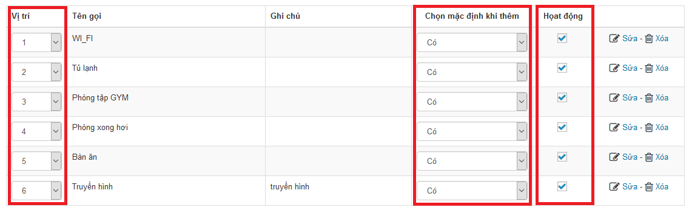

### 3.3. Tùy chỉnh tác vụ tiện nghi

| STT | Thông tin | Mô tả |
|-----|-----------|-------|
| 1 | Vị trí | Chọn vị trí để thể hiện trên danh sách |
| 2 | Chọn mặc định khi thêm | Chọn có hoặc không để thể hiện khi thêm|
| 3 | Hoạt động | Chọn checkbox để chỉnh sửa thông tin tiện nghi |

### 3.4. Tìm kiếm tiện nghi

Để tìm kiếm thông tin tiện nghi người dùng có thể nhập từ khóa và bấm tìm kiếm, thông tin tìm kiếm sẽ hiện ra dưới bảng.
 
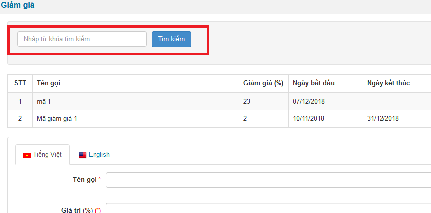 

## 4. Quản lý giảm giá
Từ giao diện chính, truy cập menu Quản lý phòng (1) / Quản lý giảm giá (2).
 
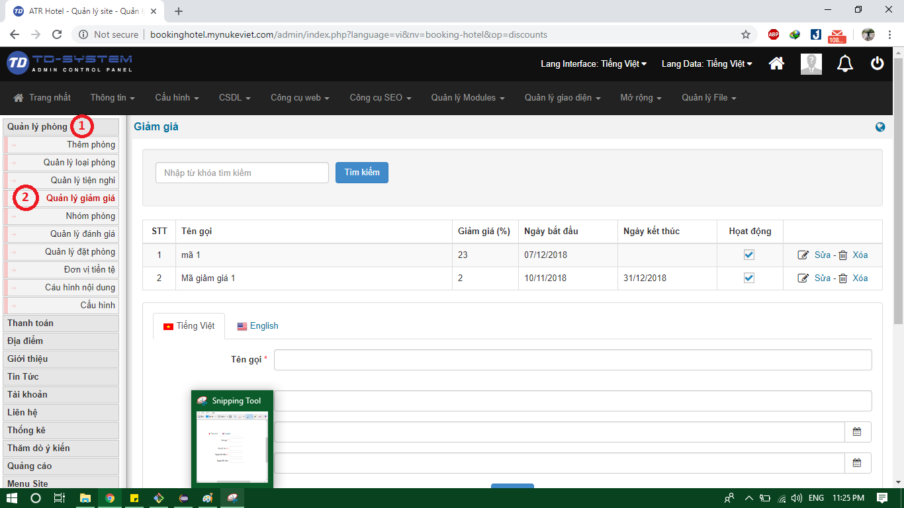

### 4.1. Thêm giảm giá
Trong giao diện dưới đây, bạn điền đầy đủ các trường thông tin, sau đó nhấn Lưu lại ở cuối trang để hoàn tất lưu lại thông tin giảm giá. 

**Chú ý: những thông tin (*) bắt buộc nhập người dùng phải nhập đầy đủ, thông tin tiếng việt nhập ngôn ngữ tiếng việt, tiếng anh nhập ngôn ngữ tiếng anh**.

### 4.2. Sửa, xóa thông tin giảm giá

Để sửa thông tin giảm giá, trên danh sách, bạn chọn liên kết Sửa, ở cuối dòng. Tương tự cho việc Xóa.

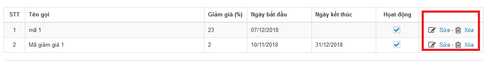

Chỉnh sửa thông tin hoạt động người dùng chọn checkbox để điều chỉnh trạng thái còn hoạt động hay không.

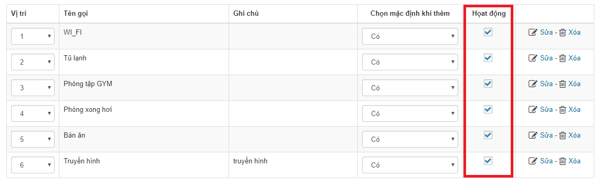

### 4.3. Tìm kiếm thông tin giảm giá

Để tìm kiếm thông tin giảm giá người dùng có thể nhập từ khóa và bấm tìm kiếm, thông tin tìm kiếm sẽ hiện ra dưới bảng.

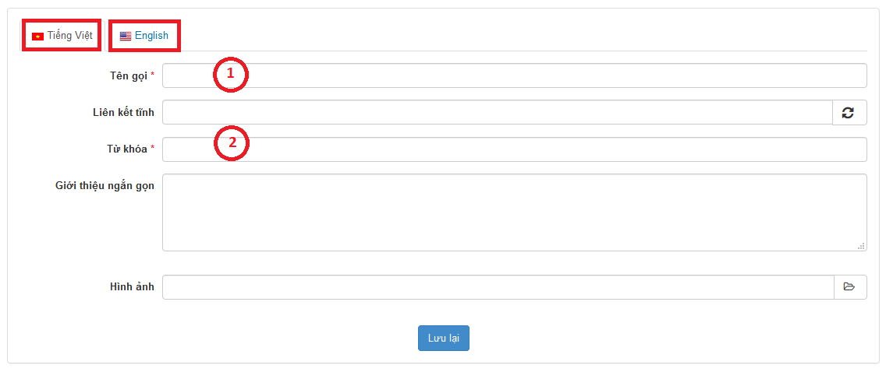

## 5. Quản lý nhóm phòng
Từ giao diện chính, truy cập menu Quản lý phòng (1) / Quản lý nhóm phòng (2).
 
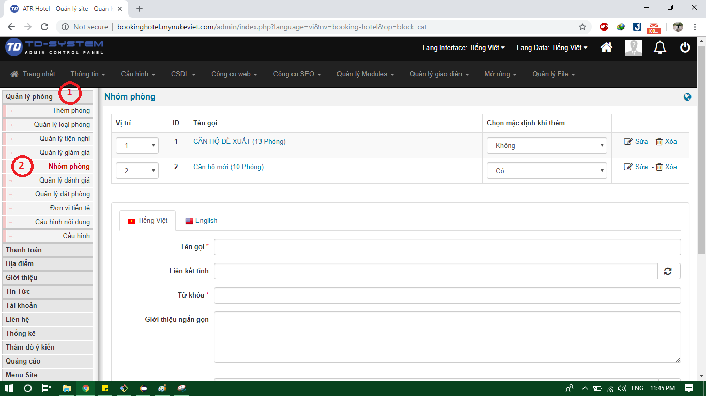

### 5.1. Thêm nhóm phòng
Trong giao diện dưới đây, bạn điền đầy đủ các trường thông tin, sau đó nhấn Lưu lại ở cuối trang để hoàn tất lưu lại thông tin nhóm phòng. 

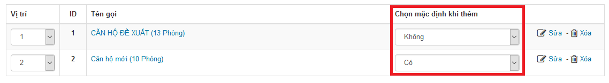

**Chú ý: những thông tin (*) bắt buộc nhập người dùng phải nhập đầy đủ, thông tin tiếng việt nhập ngôn ngữ tiếng việt, tiếng anh nhập ngôn ngữ tiếng anh**.

### 5.2. Sửa, xóa thông tin nhóm phòng

Để sửa thông tin nhóm phòng, trên danh sách, bạn chọn liên kết Sửa, ở cuối dòng. Tương tự cho việc Xóa.

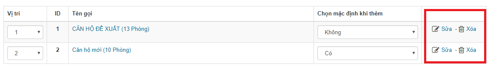

Chỉnh sửa thông tin chọn mặc định khi thêm. Nếu chọn có khi thêm phòng mặc định mục chọn sẽ được tick vào checkbox và ngược lại.

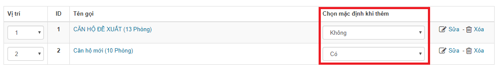

## 6. Quản lý đánh giá
Từ giao diện chính, truy cập menu Quản lý phòng (1) / Quản lý đánh giá (2).
 
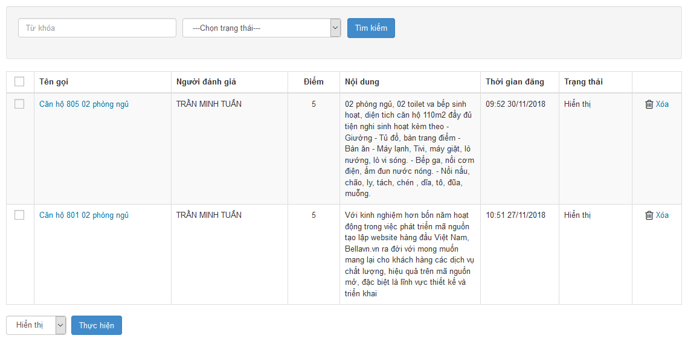

Khi click vào tên gọi đánh giá thì sẽ hiện ra thông tin phòng đánh giá.
### 6.1. Tìm kiếm đánh giá
Để tìm kiếm thông tin đánh giá người dùng có thể nhập từ khóa và bấm tìm kiếm hoặc người dùng có thể chọn tìm kiếm theo trạng thái, thông tin tìm kiếm sẽ hiện ra dưới bảng.

### 6.2. Sửa, xóa thông tin nhóm phòng

Để xóa thông tin nhóm phòng, trên danh sách, bạn chọn liên kết xóa ở cuối dòng, click vào biểu tượng xóa và xóa thông tin đánh giá.

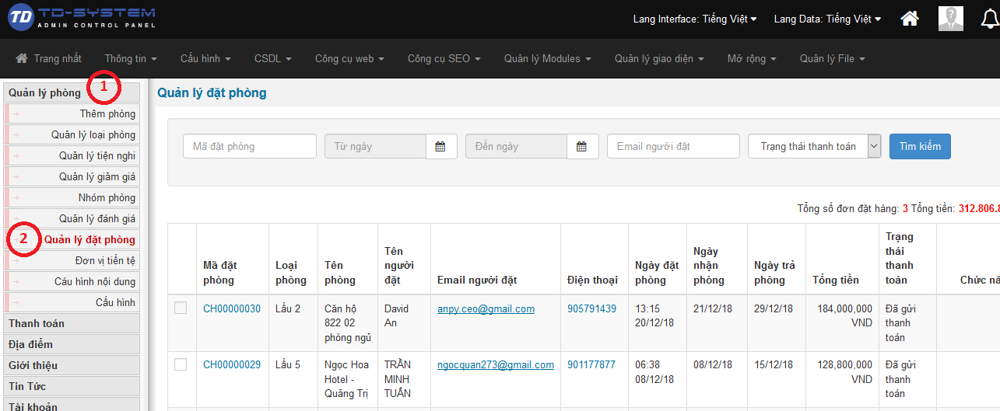

Hiển thị nhóm phòng hoặc không hoặc xóa nhóm phòng theo lựa chọn người dùng chọn theo hoạt động rồi chọn thực hiện.

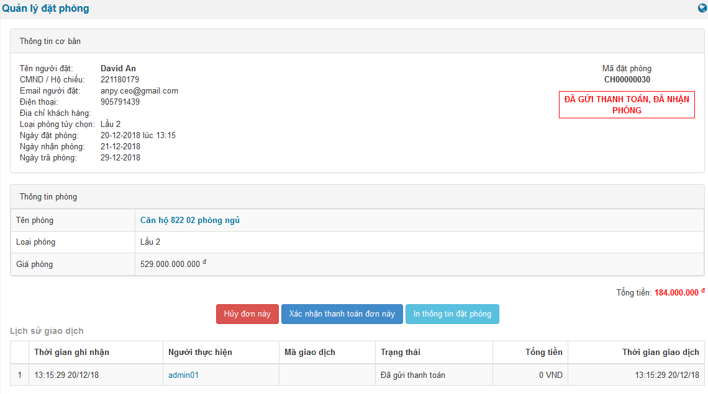

## 7. Quản lý đặt phòng
Từ giao diện chính, truy cập menu Quản lý phòng (1) / Quản lý đặt phòng (2).
 
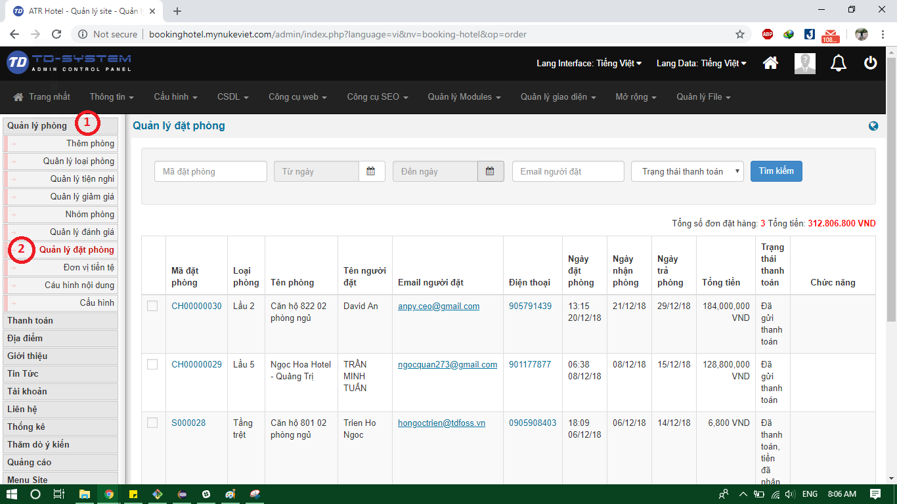

Ở table hiển thị danh sách đặt phòng clickmax đặt phòng sẽ hiện ra thông tin chi tiết đặt phòng, người dùng có thể xác nhận đơn, hủy đơn và in thông tin đặt phòng

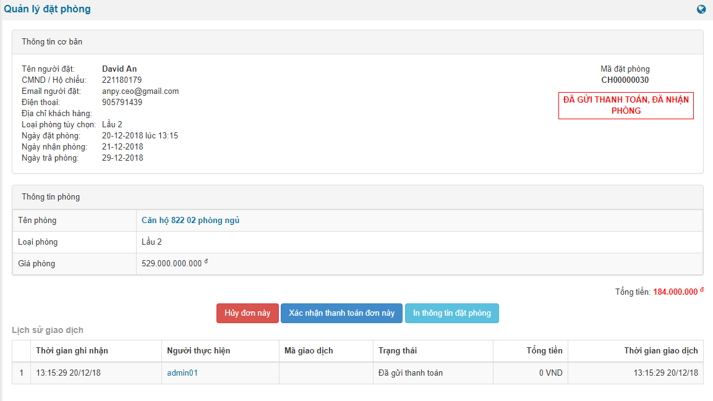

### 7.1. Tìm kiếm danh sách phòng đặt
Để tìm kiếm thông tin phòng đã đặt người dùng có thể tìm kiếm theo từ khóa, mã đặt phòng, thời gian đặt phòng, email người đặt và trạng thái thanh toán. 

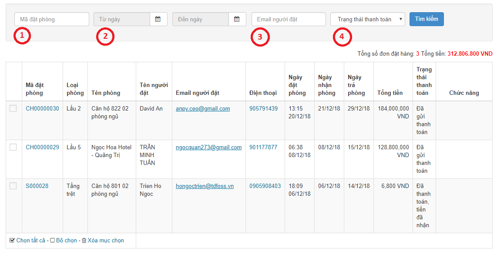

### 7.2. Hiển thị tổng số đơn hàng và tổng tiền
Để giúp người dùng nắm khái quát về số đơn hàng và tổng tiền, 2 mục số đơn hàng và tổng đơn tiền sẽ được hiển thị bên phải trên bảng hiển thị.

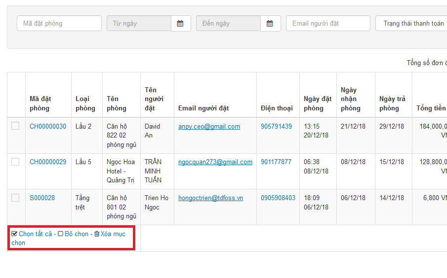

### 7.3. Xóa thông tin đặt phòng
Để xóa thông tin đặt phòng, người dùng checkbox theo mục cần chọn và chọn xóa mục chọn để xóa thông tin các mục đã chọn.

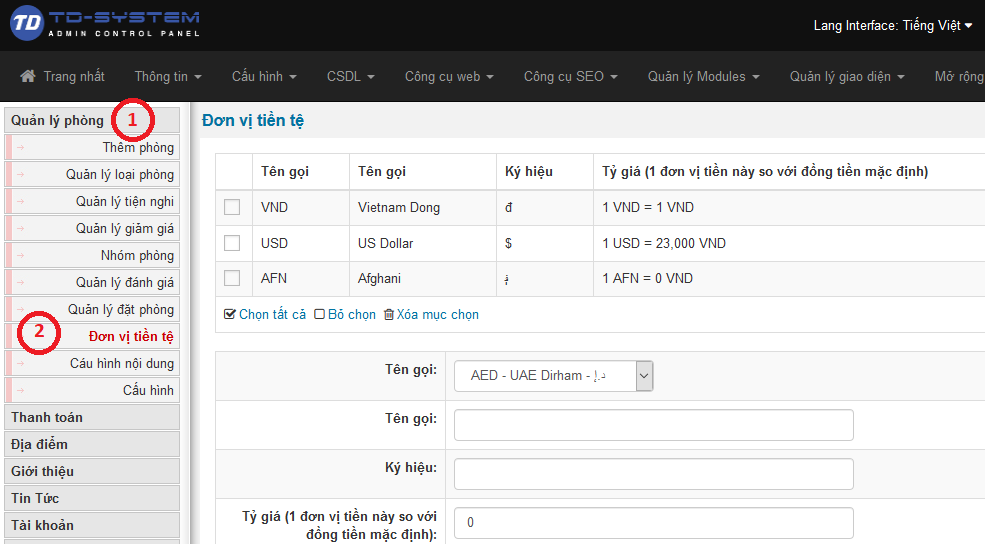

## 8. Đơn vị tiền tệ
Từ giao diện chính, truy cập menu Quản lý phòng (1) / Đơn vị tiền tệ (2).
 
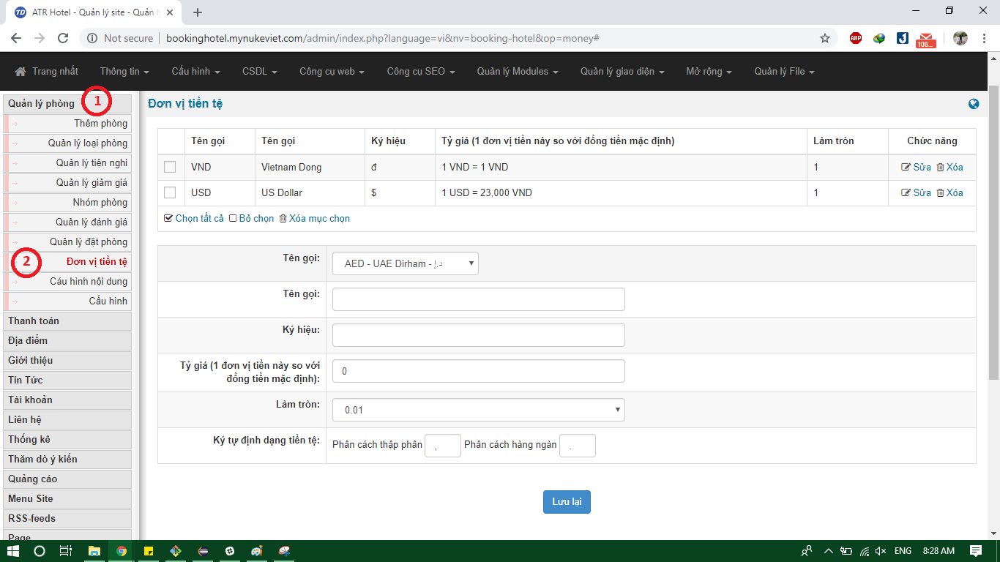

### 8.1. Thêm đơn vị tiền tệ
Trong giao diện dưới đây, bạn điền đầy đủ các trường thông tin, sau đó nhấn Lưu lại ở cuối trang để hoàn tất lưu lại thông tin đơn vị tiền tệ. 

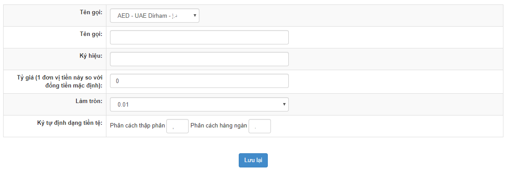

### 8.2. Sửa, xóa đơn vị tiền tệ

Để sửa thông tin đơn vị tiền tệ, trên danh sách, bạn chọn liên kết Sửa, ở cuối dòng. Tương tự cho việc Xóa.

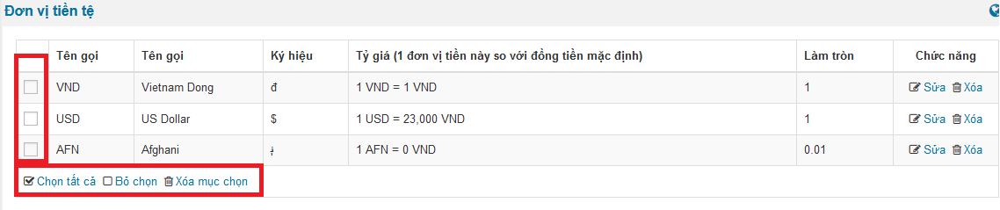

Xóa nhiều người dùng check box theo thông tin mục cần xóa và chọn xóa mục chọn.

## 9. Cấu hình nội dung
Từ giao diện chính, truy cập menu Quản lý phòng (1) / Cấu hình nội dung (2).
 

Có 3 mục người dùng cần cấu hình, xác nhận đặt phòng, xác nhận thanh toán, và thông báo nhận phòng, người dùng chọn từ khóa gợi ý và soạn nội dung.

## 10. Cấu hình
Từ giao diện chính, truy cập menu Quản lý phòng (1) / Cấu hình (2).

Mục cấu hình giúp người dùng cấu hình chức năng theo ý muốn, gồm 2 mục chính cấu hình chức năng và cấu hình giao diện.

Dưới đây là cấu hình theo chức năng:

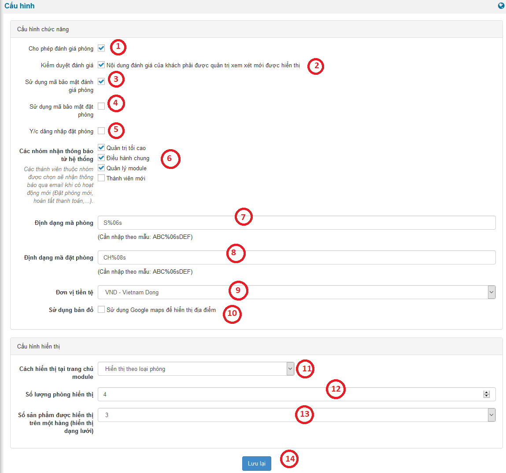

| STT | Thông tin | Mô tả |
|-----|-----------|-------|
| 1 | Cho phép đánh giá phòng | Khi người dùng chọn thì sẽ hiện ra mục đánh giá, bao gồm điểm đánh giá (sao) và các thông tin đánh giá. |
| 2 | Kiểm duyệt đánh giá | Người dùng chọn mục này thì tất cả các đánh giá phải được kiểm duyệt mới hiển thị lên trang chủ. |
| 3 | Sử dụng mã bảo mật đánh giá phòng | Khi người dùng tick vào chọn thì mã bảo mật sẽ hiện ra ở mục đánh giá và ngược lại là không nếu không chọn. |
| 4 | Sử dụng mã bảo mật đặt phòng | Khi người dùng tick vào mục này thì khi đặt phòng người dùng sẽ thấy mã xác nhận đặt phòng ở ngoài site|
| 5 | Y/c đăng nhập đặt phòng | Người dùng chọn mục này sẽ hiện ra thông báo phải đăng nhập mới được đặt phòng. |
| 6 | Các nhóm nhận thông báo từ hệ thống | Chọn muc này người dùng sẽ quyết định nhóm người dùng nào nhận được thông báo từ hệ thống |
| 7 | Định dạng mã phòng |Người dùng tự quy định mã phòng theo mẫu gợi ý có sẵn của nhà phát triển |
| 8 | Định dạng mã đặt phòng | Người dùng tự quy định mã đặt phòng theo mẫu gợi ý có sẵn của nhà phát triển |
| 9 | Đơn vị tiền tệ | Người dùng chọn đơn vị tiền tệ để quy ước đơn vị giá cả của module |
| 10 | Sử dụng bản đồ | Người dùng chọn google map để hiển thị địa điểm |

Dưới đây là cấu hình giao diện:

| STT | Thông tin | Mô tả |
|-----|-----------|-------|
| 1 | Cách hiển thị tại trang chủ module | Khi người dùng chọn cách hiển thị theo loại phòng , tất cả hoặc không hiển thị. |
| 2 | Số lượng phòng hiển thị | Người dùng điền thông tin vào mục để hiển thị ngoài site. |
| 3 | Số sản phẩm được hiển thị trên một hàng (hiển thị dạng lưới) | Khi người dùng chọn thì số sản phẩm sẽ được hiển thị theo ý người dùng muốn. |

## 11. Trang chủ website

Khi đến với trang chủ website khách hàng sẽ thấy ngay mục tìm kiếm thông tin loại phòng.

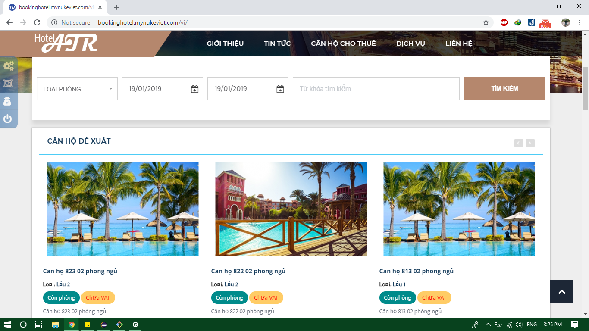 

Phía dưới mục tìm kiếm thông tin phòng là 2 mục gợi ý **"Căn hộ đề xuất"** và **"Căn hộ mới"**.

### 11.1. Tìm kiếm thông tin phòng

Người dùng có thể tìm kiếm thông tin phòng qua **Loại phòng**, thời gian và từ khóa tìm kiếm.

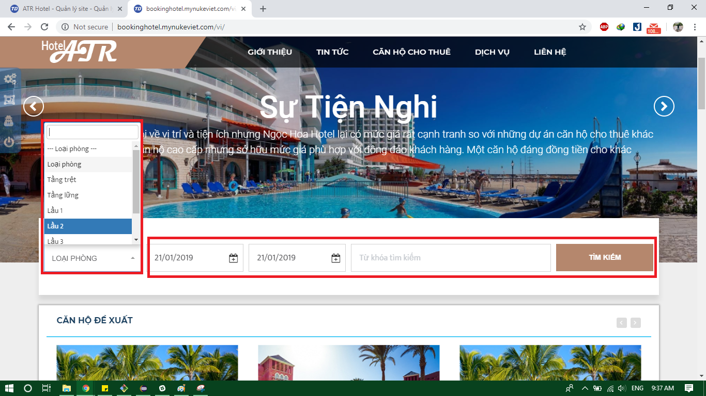

Sau khi tìm kiếm thông tin người dùng tìm kiếm sẽ được hiển thị dưới danh sách, danh sách sẽ hiển thị thông tin giá cả, dịch vụ tiện ích, loại phòng , tình trạng...

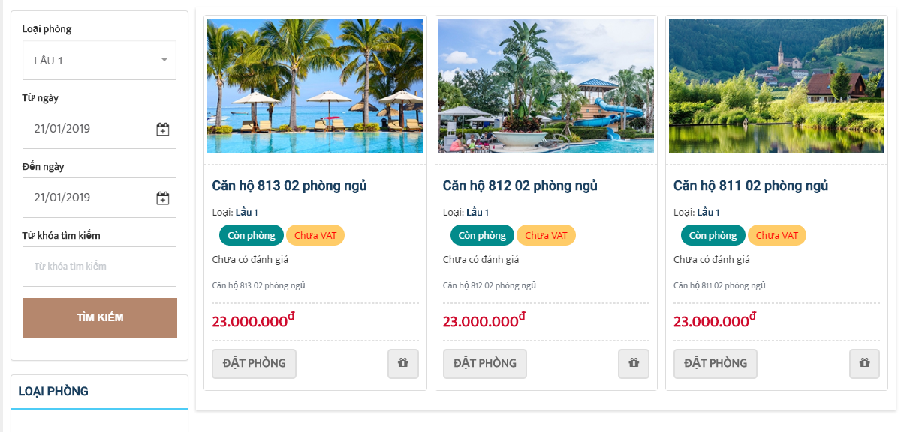

### 11.2. Đặt phòng
Sau khi tìm kiếm được thông tin phòng thích hợp người dùng click vào Đặt phòng.

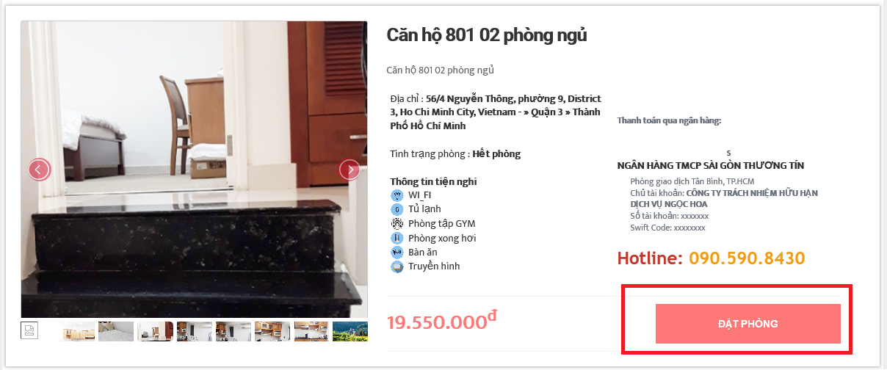

Ở mục đặt phòng sẽ có thông tin chi tiết, đặt phòng và đánh giá người dùng có thể tham khảo và lựa chọn cho mình sự lựa chọn tốt nhất.

Người dùng điền tất cả thông tin vào để đắt phòng, hoàn tất click vào gửi thông tin.

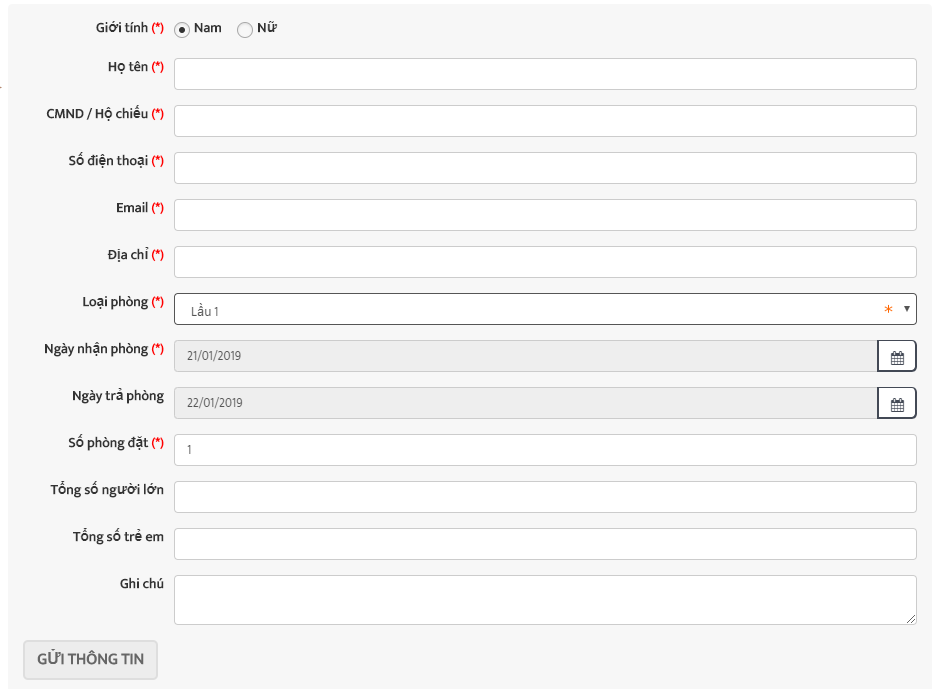

**Chú ý: những thông tin (*) bắt buộc nhập người dùng phải nhập đầy đủ** .

### 11.3. Đánh giá phòng
Người dùng sau khi sử dụng xong có thể vào phần đánh giá, đánh giá chất lượng phòng.

### 11.4. Đăng ký đặt phòng hôm nay

Để đăng ký đặt phòng trong ngày người dùng có thế kéo xuống phía dưới website, form đặt phòng hôm nay sẽ hiện ra, người dùng điền thông tin và gửi thông tin để đặt phòng trong ngày.

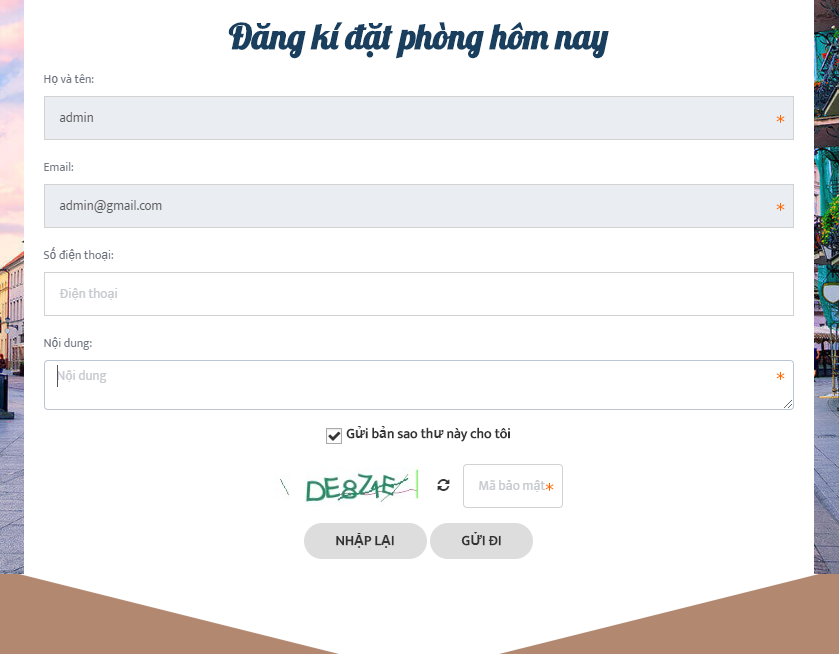

**Chú ý: những thông tin (*) bắt buộc nhập người dùng phải nhập đầy đủ** 
