## HƯỚNG DẪN SỬ DỤNG HỆ THỐNG KIỂM KÊ TÀI SẢN

## I. ĐĂNG NHẬP KHU VỰC QUẢN TRỊ.

-	Nếu là người quản trị hệ thống, bạn tiến hành truy cập vào tài khoản quản trị qua đường dẫn này [www.kiemke.cuudinh.vn/admin](http://kiemke.cuudinh.vn/admin).

-	Thông tin username + password đã được gửi qua email người chịu trách nhiệm dự án.

## II.	QUẢN TRỊ TÀI KHOẢN..

### 1. Thêm tài khoản mới:
- Chọn module Quản lý tài khoản, chọn Menu Thêm tài khoản mới (hoặc URL này [www.kiemke.cuudinh.vn/admin/index.php?language=vi&nv=users&op=user_add](http://kiemke.cuudinh.vn/admin/index.php?language=vi&nv=users&op=user_add)).
- Nhập dữ liệu theo mẫu:
	- Tài khoản (1): Nhập họ và tên của chủ tài khoản.
	- Email (2): Nhập địa chỉ mail của tài khoản.
	- Mật khẩu (3): Nhập mật khẩu truy cập cho tài khoản. Có thể nhập trực tiếp hoặc chọn Tạo mật khẩu ngẫu nhiên (4). Hệ thống sẽ tự dộng tạo và gửi về mail của tài khoản.
	- Lặp lại mật khẩu (5): Nhập lại mật khẩu. Có thể chọn hiển thị mật khẩu tại vị trí 6.
	- Họ và tên đệm (7): Nhập Họ và tên đệm của người dùng.
	- Tên (8): Nhập tên người dùng.
	- Giới tính (9): Chọn giới tính người dùng.
	- Ngày tháng năm sinh (10): Chọn ngày tháng năm sinh.
	- Chữ ký (11): Tạo chữ ký sẽ hiển thị ở phần thông tin cá nhân.
	- Câu hỏi bảo mật (12) và Trả lời câu hỏi (13): Sử dụng để bảo vệ tài khoản.
	- Hình đại diện (14): Chọn hình đại diện cho tài khoản. Chọn thêm file ảnh tại vị trí số (15).
	- Hiển thị mail (16): Cho phép hiển thị mail trên danh sách tài khoản nếu tích chọn.
	- Là tài khoản của nhóm (17): Tích chọn nhóm cho tài khoản vừa thêm.
	- Là thành viên chính thức (18): Tích chọn nếu tài khoản là thành viên chính thức.
	- Gửi mail thông báo (19) Khi tích mọi, các thông tin của tài khoản sẽ được gửi về mail của tài khoản.
	- Thêm tài khoản (20): Nhấn chọn Thêm tài khoản để lưu lại dữ liệu.
	
**Chú ý: Các trường dữ liệu có dấu “ *  ” là bắt buộc phải nhập**
	
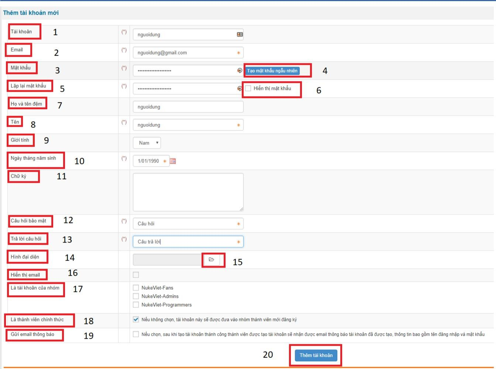 

### 2. Quản lý tài khoản:

Hệ thống quản lý các tài khoản trên hệ thống dưới dạng danh sách với các thông tin sau:

- Tài khoản (1): Tên tài khoản
- Họ và tên (2): Họ tên chủ tài khoản
- Mail (3): Địa chỉ mail của tài khoản
- Ngày đăng ký (4): Ngày đăng ký tài khoản
- Hoạt động (5): Tình trạng hoạt động của tài khoản
- Chức năng (6): Sửa hoặc xóa thông tin tài khoản.
- Tìm kiếm (7): Hệ thống hỗ trợ tìm kiếm tài khoản trên danh sách.

 

### 3. Thêm quản trị.

Để thêm quản trị, thành viên đó phải có tài khoản trên hệ thống. - Chọn Module Quản trị, chọn

menu Thêm quản trị (hoặc URL này [www.kiemke.cuudinh.vn/admin/index.php?language=vi&nv=authors&op=add](http://kiemke.cuudinh.vn/admin/index.php?language=vi&nv=authors&op=add)).

- Nhập dữ liệu theo mẫu:
	- Chỉ định thành viên(1): Nhập tên tài khoản hoặc chọn (2) ở danh sách tài khoản có sẵn.
	- Chức danh (3): Nhập chức danh cho tài khoản muốn thêm.
	- Giao diện người quản trị (4): Chọn giao diện admin.
	- Trình soạn thảo (5): Cho phép người quản trị có nhiều tùy chọn nhập liệu văn bản.
	- Các kiểu file được phép tải lên (6) Tích chọn kiểu file tài khoản quản trị được phép tải lên hệ thống.
	- Được phép sửa, xóa file (7): Tích chọn nếu tài khoản quản trị được phép .
	- Được phép tạo thư mục (8): Tích chọn nếu tài khoản được phép tạo thư mục trên hệ thống.
	- Được phép đổi tên, xóa thư mục (9): Tích chọn nếu quản trị được phép.
	- Quyền hạn (10): Tích chọn quyền hạn cho quản trị.
	- Thêm quản trị website (11): Nhấn chọn để lưu dữ liệu.

**Chú ý: Các trường dữ liệu có dấu “ *  ” là bắt buộc phải nhập**

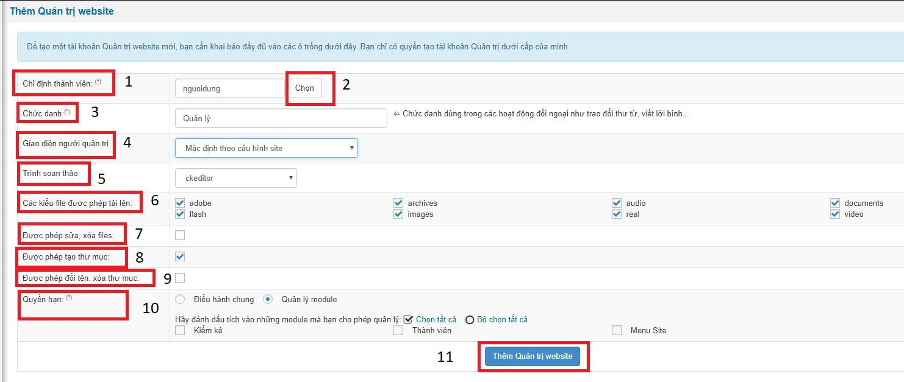 

### 4. Quản lý Quản trị trang:

Danh sách các tài khoản quản trị trên trang gồm các dữ liệu:

- Tên tài khoản (1): Tên tài khoản quản trị.
- Email (2): Địa chỉ mail của tài khoản.
- Chức danh (3): Chức danh của tài khoản quản trị.
- Quyền hạn (4): Quyền hạn của tài khoản quản trị trên trang.
- Tình trạng hiện tại (5): Tình trạng hoạt động của tài khoản.
- Chức năng (6): Sửa, đình chỉ hoạt động, xóa tài khoản quản trị Tài khoản quản trị chỉ được phép sửa hoặc xóa tài khoản quản trị cùng hoặc dưới cấp.

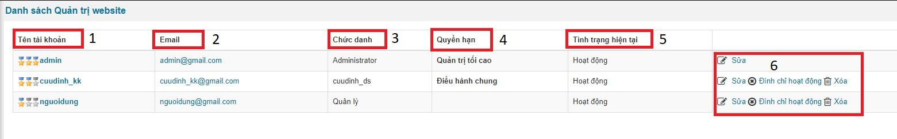 

## III. SỬ DỤNG HỆ THỐNG KIỂM KÊ TÀI SẢN.

Truy cập tên miền chính [www.kiemke.cuudinh.vn](kiemke.cuudinh.vn ) và đăng nhập tài khoản đã được cấp

### 1. Loại tài sản:

- Quản trị tài sản:
	- Thêm loại tài sản (1): Thêm loại tài sản mới.
	- Tên loại tài sản (2): Tên các loại tài sản hiện có.
	- Ghi chú (3): Ghi chú về tài sản.
	- Chức nâng sửa xóa (4): Cập nhật về tài sản.
	
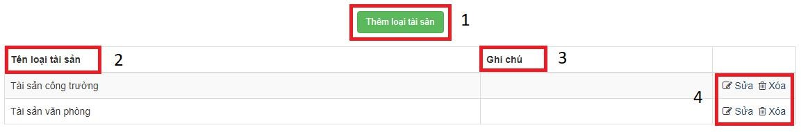 

- Thêm loại tài sản: Nhập dữ liệu theo mẫu ( * là bắt buộc ).
	- Tên loại tài sản (1): Nhập tên tài sản.
	- Ghi chú (2): Nhập ghi chú về loại tài sản nếu có.
	- Lưu thay đổi (3): Nhấn chọn để lưu dữ liệu.
	
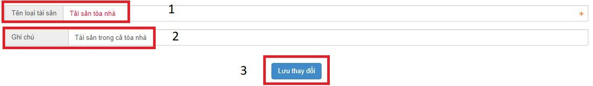 
	
### 2. Nhà sản xuất:

- Quản trị nhà sản xuất:
	- Thêm nhà sản xuất (1): Thêm nhà sản xuất mới.
	- Tên nhà sản xuất (2): Tên các nhà sản xuất hiện có.
	- Ghi chú (3): Ghi chú về nhà sản xuất.
	- Chức nâng sửa xóa (4): Cập nhật về nhà sản xuất.
	
 

- Thêm nhà sản xuất
	- Tên nhà sản xuất (1): Nhập nhà sản xuất .
	- Ghi chú (2): Nhập ghi chú về nhà sản xuất nếu có.
	- Lưu thay đổi (3): Nhấn chọn để lưu dữ liệu.
	
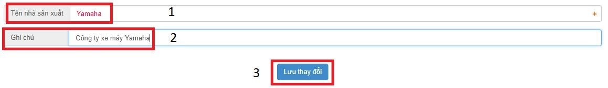 

**Chú ý: Các trường dữ liệu có dấu “ *  ” là bắt buộc phải nhập**

### 3. Phòng ban:

- Quản trị phòng ban:
	- Thêm phòng ban (1): Thêm phòng ban mới.
	- Tên phòng ban (2): Tên các phòng ban hiện có.
	- Ghi chú (3): Ghi chú về phòng ban.
	- Chức nâng sửa xóa (4): Cập nhật về phòng ban.

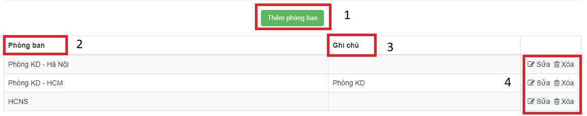 

- Thêm phòng ban:
	- Người quản lý (1): Chọn người quản lý có tài khoản quản trị ở hệ thống.
	- Tên phòng ban (2): Nhập phòng ban .
	- Ghi chú (3): Nhập ghi chú về phòng ban nếu có.
	- Lưu thay đổi (4): Nhấn chọn để lưu dữ liệu

**Chú ý: Các trường dữ liệu có dấu “ *  ” là bắt buộc phải nhập**

 

### 4. Đơn vị tài sản:

- Quản trị đơn vị tài sản:
	- Thêm đơn vị tài sản (1): Thêm đơn vị tài sản mới.
	- Tên đơn vị tài sản (2): Tên các đơn vị tài sản hiện có.
	- Ghi chú (3): Ghi chú về đơn vị tài sản.
	- Chức nâng sửa xóa (4): Cập nhật về đơn vị tài sản.

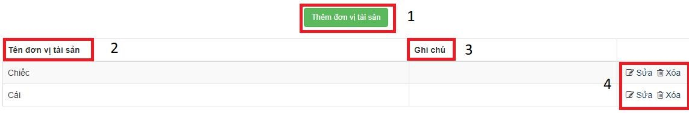 

- Thêm đơn vị tài sản:
	- Tên đơn vị tài sản (1): Nhập đơn vị tài sản .
	- Ghi chú (2): Nhập ghi chú về đơn vị tài sản nếu có.
	- Lưu thay đổi (3): Nhấn chọn để lưu dữ liệu.

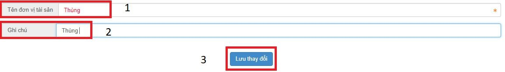 

**Chú ý: Các trường dữ liệu có dấu “ *  ” là bắt buộc phải nhập**

### 5. Quản lý tài sản:

- Quản trị tài sản:
	- Tìm kiếm (1): Nhập tên tài sản cần tìm vào ô Tìm kiếm theo từ khóa, lọc theo giá trị phòng ban (1.1), lọc theo trạng thái (1.2), số lượng kết quả tìm kiếm (1.3), nhấn chọn tìm kiếm để tìm kiếm tài sản.
	- Chức nâng xuất file excel (3): Nhập tháng/năm của tài sản có ở danh sách tài sản cần xuất (05/2018), nhấn chọn Trích xuất excel khấu hao tài sản để xuất file excel tính khấu hao tài sản,
	Trích xuất excel phân bổ CCDC để xuất file excel phân bổ công cụ dụng cụ.
	- Phòng Ban (6): Bộ phận sử dụng.
	- Trạng thái (7): Hiển thị và ẩn của tài sản.
	- Số lượng (8): Số lượng tài sản hiện có.
	- Thời gian đưa vào sử dụng (10): Bắt đầu tính thời gian khấu hao của tài sản.
	- Thời gian khấu hao (11): Bắt đầu tính khấu hao từ Thời gian đưa vào sử dụng.
	- Chức nâng sửa xóa (12): Cập nhật về đơn vị tài sản.
	
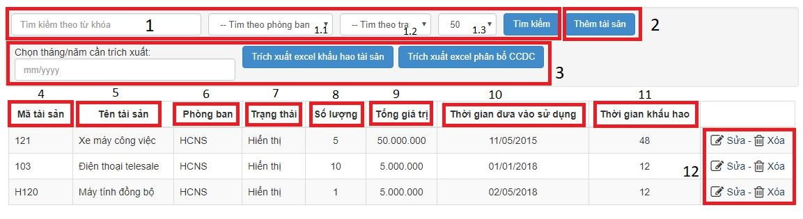 

- Thêm tài sản:
	- Nhà sản xuất (1): Chọn nhà sản xuất có sẵn trong ô dữ liệu đã tạo ở phần Nhà sản xuất.
	- Đơn vị (2): Chọn đơn vị có sẵn ở ô dữ liệu đã tạo ở phần Đơn vị tài sản.
	- Loại tài sản (3): Chọn loại tài sản có sẵn ở ô dữ liệu đã tạo ở phần Loại tài sản.
	- Trạng thái (4): Trạng thái hoạt động của tài sản, chọn ở ô dữ liệu có sẵn.
	- Bộ phận sử dụng (5): Chọn bộ phận sử dụng có sẵn ở ô dữ liệu đã tạo ở phần Phòng ban.
	- Phòng sử dụng (6): Nhập các phòng khác nếu có.
	- Mã tài sản (7): Nhập mã tài sản nếu có.
	- Tên tài sản (8): Nhập tên gọi của tài sản.
	- Thời gian đưa vào sử dụng (9): Nhập thời gian bắt đầu sử dụng để tính khấu hao sản phẩm.
	- Thời gian khấu hao (10): Nhập thời gian khấu hao để tính khấu hao tài sản.
	- Số lượng (11): Số lượng tài sản nhập về.
	- Tổng giá trị (12): Nhập tổng giá trị tài sản, dùng tính khấu hao tài sản.
	- Lưu thay đổi (13): Nhấn chọn để lưu tài sản.

**Chú ý: Các trường dữ liệu có dấu “ *  ” là bắt buộc phải nhập**

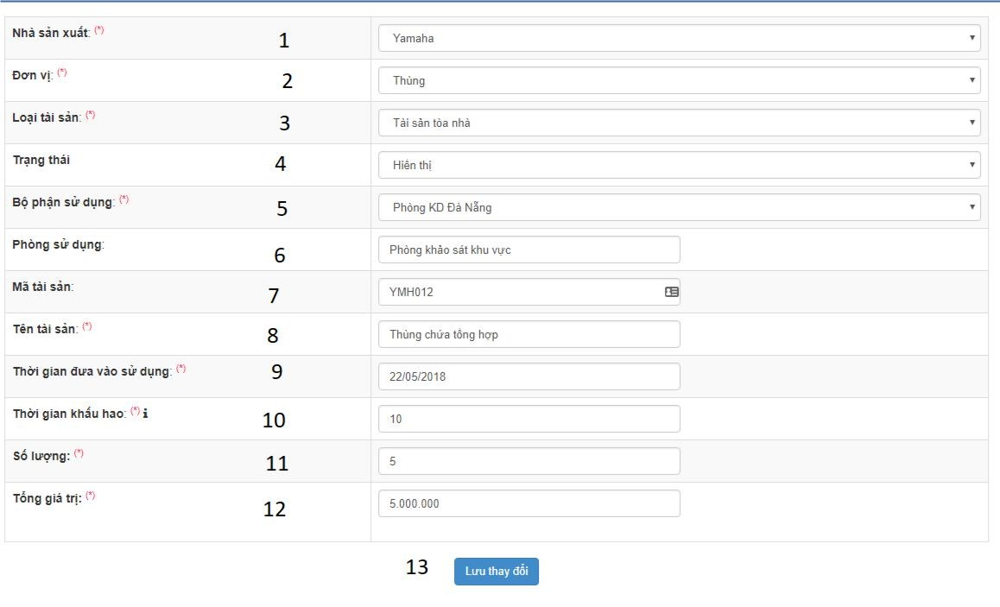 

### 6. Kiểm kê tài sản:

- Quản trị kiểm kê tài sản:
	- Tìm kiếm (1): Nhập tìm kiếm vào ô Tìm kiếm phòng ban sử dụng nhấn tìm kiếm để tìm theo phòng ban kiểm kê.
	- Kiểm kê tài sản (2): Tạo đợt kiểm kê tài sản mới.
	- Stt (3): Số thứ tự của đợi kiểm kê.
	- Phòng kiểm kê (4): Tên các phòng kiểm kê tài sản theo đợi.
	- Thời gian kiểm kê (5): Thời gian tạo kiểm kê.
	- Xóa (6): Xóa đợt kiểm kê.
	
 

- Kiểm kê tài sản:
	- Đơn vị (A): Chọn đơn vị cần kiểm kê tài sản.
	- Thời gian kiểm kê (B): Nhập thời gian bắt đầu kiểm kê.
	- Thành phần ban kiểm kê gồm: Nhập tìm kiếm nhân sự tham gia kiểm kê (D) và nhấn chọn nhân sự, Chức vụ: nhập chức vụ của thành viên tham gia kiểm kê (E), bỏ chọn nhân sự tham gia kiểm kê (C).
	- 1: Số thứ tự tài sản.
	- 2: Danh sách tên tài sản.
	- 3: Đơn vị tài sản.
	- 5: Bộ phận sử dụng là đơn vị được kiểm kê.
	- 6: Số lượng tài sản khi nhập vào
	- 7: Tổng giá trị của tài sản.
	- 8: Giá trị còn sau khi tính trừ khấu hao.
	- 9: Nhập số lượng kiểm kê thực tại hiện có sau khi kiểm kê.
	- 10: Nhập số lượng tài sản hỏng nếu có.
	- 11: Số lượng tài sản đang sử dụng.
	- 12: Nhập số lượng tài sản thừa nếu có.
	- 13: Nhập số lượng tài sản thiếu nếu có.
	- 14: Ghi chú về tài sản sau khi kiểm kê.
	- Ghi dữ liệu: Nhấn ghi dữ liệu để kết thúc kiểm kê.

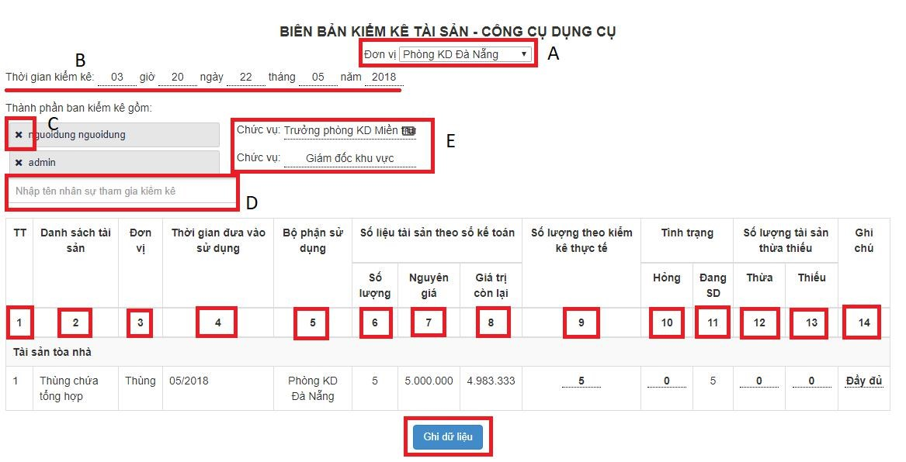 