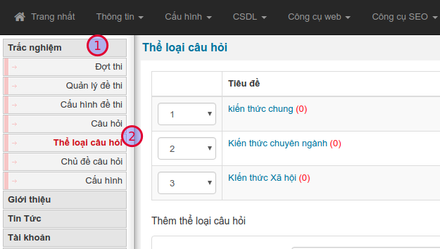
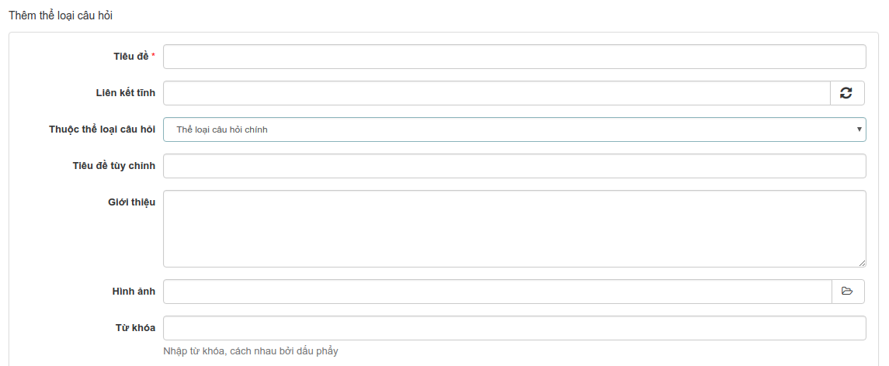
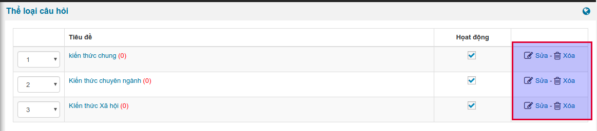
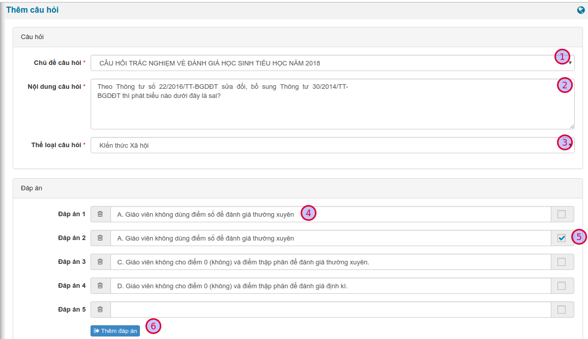
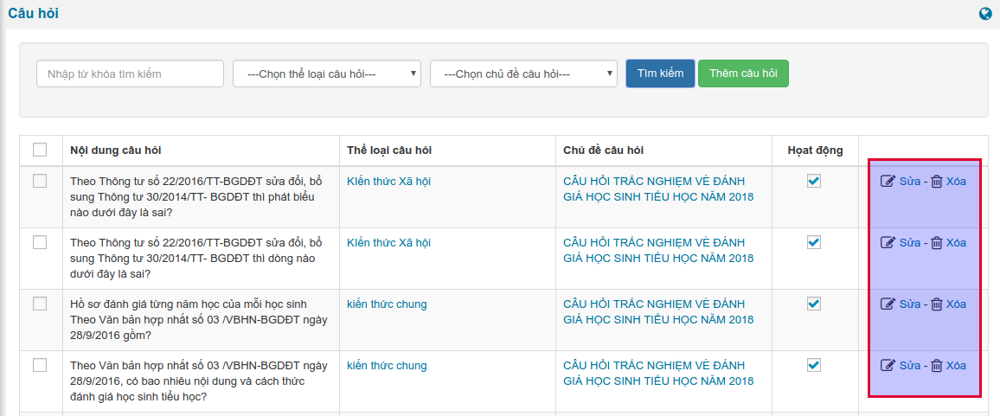
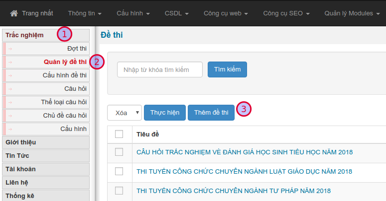
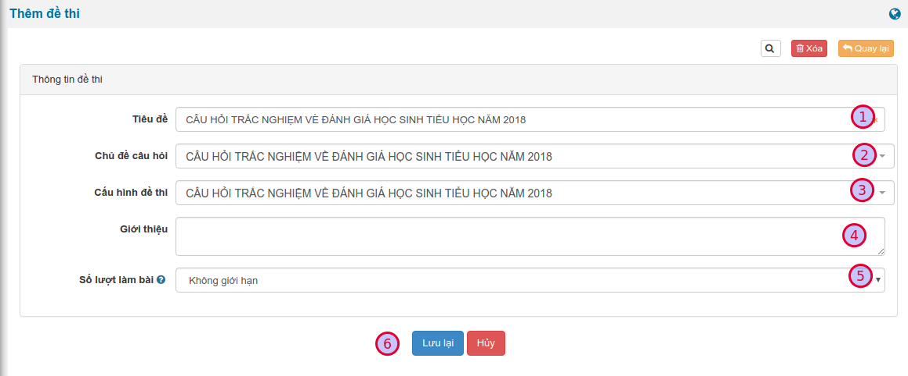
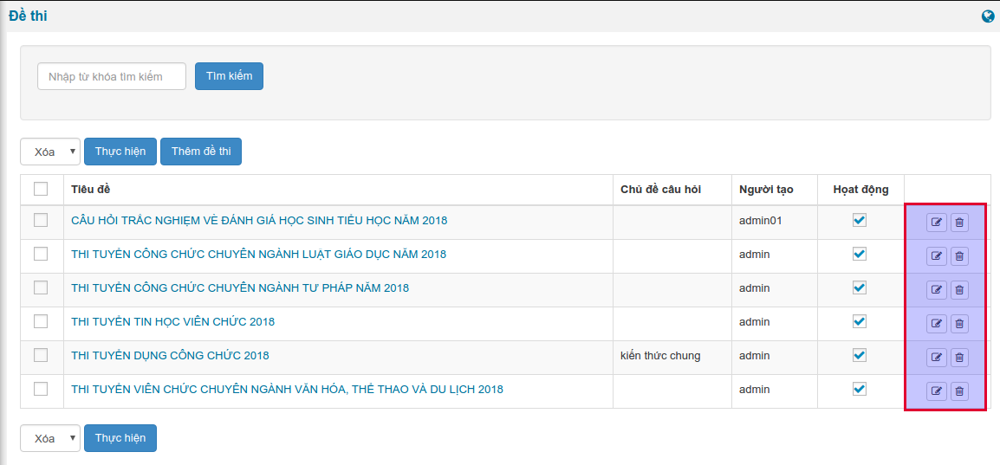
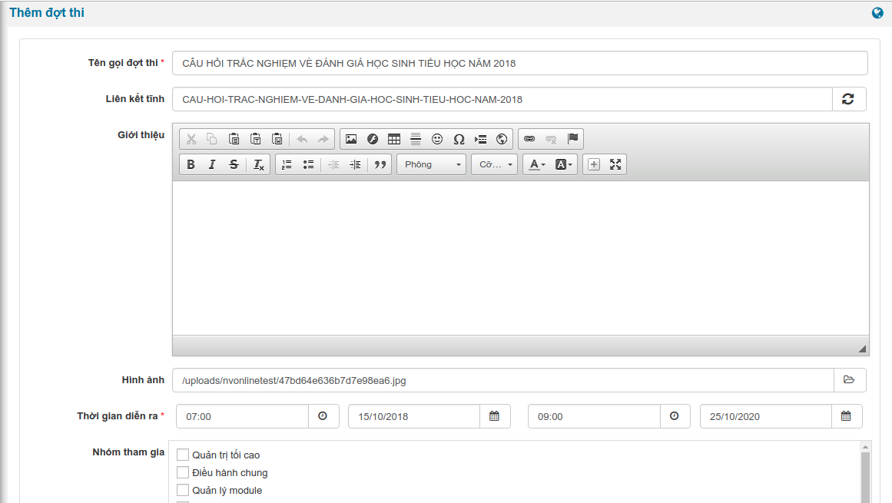

Dưới đây là các hạng mục quan trọng nhất, bạn cần đọc và thực hiện lần lượt từ 1 -> 7

## 1. Quản lý chủ đề câu hỏi

Câu hỏi sẽ được chia thành các chủ đề đẻ quản lý

### 1.1. Tạo chủ đề

Từ giao diện chính, truy cập menu **Trắc nghiệm (1) / Chủ đề câu hỏi (2)**

Để thêm chủ đề mới, kéo xuống biểu mẫu cuối trang, bạn cần điền những trường thông tin có đánh dấu sao (*)

Nhấn **Lưu lại** để thêm. Hệ thống sẽ chuyển về danh sách các chủ đề hiện có.

### 1.2. Sửa, xóa chủ đề

Để sửa thông tin chủ đề, trên danh sách, bạn chọn liên kết **Sửa**, ở cuối dòng. Tương tự cho việc **Xóa**

## 2. Quản lý thể loại câu hỏi

Câu hỏi được chia thành nhiều thế loại để phân loại quản lý

### 2.1. Tạo thể loại câu hỏi

Từ giao diện chính, truy cập menu **Trắc nghiệm (1) / Thể loại câu hỏi (2)**

Để thêm thể loại câu hỏi mới, kéo xuống biểu mẫu cuối trang, bạn cần điền những trường thông tin có đánh dấu sao (*)

Nhấn **Lưu lại** để thêm. Hệ thống sẽ chuyển về danh sách các thể loại câu hỏi hiện có.

### 2.2. Sửa, xóa thể loại câu hỏi

Để sửa thông tin thể loại câu hỏi, trên danh sách, bạn chọn liên kết **Sửa**, ở cuối dòng. Tương tự cho việc **Xóa**

## 3. Quản lý câu hỏi

### 3.1. Thêm câu hỏi mới

Từ giao diện chính, truy cập menu **Trắc nghiệm (1) / Câu hỏi (2) / Thêm câu hỏi (3)**

Trong giao diện tiếp theo, bạn điền đầy đủ các trường thông tin, sau đó nhấn **Lưu lại** ở cuối trang để hoàn tất.

| STT | Thông tin | Mô tả |
|-----|-----------|-------|
| 1 | Chủ đề câu hỏi | Chọn chủ đề câu hỏi. Danh sách chủ đề được quản lý tại [Quản lý chủ đề câu hỏi](#1-quan-ly-chu-e-cau-hoi) |
| 2 | Tiêu đề | Tiêu đề, là nội dung câu hỏi |
| 3 | Thể loại câu hỏi | Chọn thể loại câu hỏi. Danh sách thể loại được quản lý tại [Quản lý thể loại câu hỏi](#2-quan-ly-the-loai-cau-hoi) |
| 4 | Đáp án | <ul><li>Bạn cần thêm ít nhất 02 đáp án cho câu hỏi</li><li>Nhập nội dung cho đáp án tại (4)</li><li>Chọn đáp án đúng cho câu trả lời tại (5). `Lưu ý: Có thể chọn nhiều câu trả lời đúng`</li><li>Thêm đáp án tại (6)</li><ul> |

### 3.2. Sửa, xóa câu hỏi

Để sửa thông tin câu hỏi, trên danh sách, bạn chọn liên kết **Sửa**, ở cuối dòng. Tương tự cho việc **Xóa**

## 4. Quản lý cấu hình đề thi

Cấu hình đề thi là việc thiết lập các thông số cơ bản để triển khai một đề thi

### 4.1. Tạo cấu hình đề thi mới

Từ giao diện chính, truy cập menu **Trắc nghiệm (1) / Cấu hình đề thi (2) / Tạo cấu hình (3)**

Trong giao diện tiếp theo, bạn điền đầy đủ các trường thông tin, sau đó nhấn **Lưu lại** ở cuối trang để hoàn tất.

| STT | Thông tin | Mô tả |
|-----|-----------|-------|
| 1 | Tiêu đề | Nhập tên gọi của cấu hình |
| 2 | Thời gian làm bài | Nhập thời gian làm bài (phút) của đề thi thuộc cấu hình này |
| 3 | Số lượng câu hỏi | Nhập số câu hỏi của đề |
| 4 | Cấu hình câu hỏi | <ul><li>Bạn có thể thêm nhiều [thể loại câu hỏi](#2-quan-ly-the-loai-cau-hoi)</li><li>Tổng số câu hỏi của mỗi thể loại cần bằng với số câu hỏi được thiết lập ở (3)</li><li>Hệ thống sẽ tạo ma trận câu hỏi theo cầu hình này</li><ul> |

### 4.2. Sửa, xóa cấu hình câu hỏi

Để sửa thông tin cấu hình câu hỏi, trên danh sách, bạn chọn liên kết **Sửa**, ở cuối dòng. Tương tự cho việc **Xóa**

## 5. Quản lý đề thi

### 5.1. Tạo đề thi mới

Từ giao diện chính, truy cập menu **Trắc nghiệm (1) / Đề thi (2) / Thêm đề thi (3)**

Trong giao diện tiếp theo, bạn điền đầy đủ các trường thông tin, sau đó nhấn **Lưu lại (6)** ở cuối trang để hoàn tất.

| STT | Thông tin | Mô tả |
|-----|-----------|-------|
| 1 | Tiêu đề | Nhập tên gọi của đề thi |
| 2 | [Chủ đề câu hỏi](#1-quan-ly-chu-e-cau-hoi) | Chọn chủ đề câu hỏi |
| 3 | [Cấu hình đề thi](#4-quan-ly-cau-hinh-e-thi) | Chọn cấu hình đề thi |
| 4 | Giới thiệu | Nhập giới thiệu ngắn gọn về đề thi |
| 5 | Số lượt làm bài | Chọn số lượt làm bài trên mỗi đề, ứng với một người thi |

### 5.2. Sửa, xóa đề thi

Để sửa thông tin đề thi, trên danh sách, bạn chọn liên kết **Sửa**, ở cuối dòng. Tương tự cho việc **Xóa**

## 6. Quản lý đợt thi

### 6.1. Tạo đợt thi mới

Từ giao diện chính, truy cập menu **Trắc nghiệm (1) / Đợt thi (2) / Thêm đợt thi (3)**

Trong giao diện tiếp theo, bạn điền đầy đủ các trường thông tin, sau đó nhấn **Lưu lại (6)** ở cuối trang để hoàn tất.

> Bạn cần điền đầy đủ các trường thông tin có đánh dấu sao (*)

| Thông tin | Mô tả |
|-----------|-------|
| Tên gọi đợt thi | Nhập tên gọi của đợt thi |
| Liên kết tĩnh | Hệ thống tự điền khi bạn nhập xong tên gọi đợt thi. Bạn cứ để mặc định, không được xóa nội dung phần này |
| Giới thiệu | Nhập nội dung giới thiệu đợt thi. Nội dung này sẽ hiển thị khi bắt đầu làm bài |
| Hình ảnh | Chọn hình ảnh đại diện. Hình ảnh này sẽ hiển thị trong danh sách đợt thi bên ngoài site |
| Thời gian diễn ra | Chọn thời gian bắt đầu và thời gian kết thúc đợt thi |
| Nhóm tham gia | Chọn nhóm thành viên được phép làm bài |
| Số câu hỏi trên trang | Nhập số câu hỏi hiển thị trên một trang danh sách, trong khi làm bài thi |
| Hiển thị đáp án | Cho phép hiển thị đáp án đúng sau khi người thi nộp bài hay không |
| Thêm dự đoán | Hiển thị thêm câu hỏi phụ, dự đoán có bao nhiêu người trả lời đúng tất cả |
| Cho phép thi lại | Cho phép người thi làm lại bài thi trong thời gian diễn ra thi. Hệ thống sẽ ghi lại kết quả thi cao nhất |
| Đề thi | Chọn đề thi ứng với đợt thi này |

Sau khi thêm đợt thi thành công, đợt thi mới sẽ hiển thị tại trang chủ.

### 6.2. Sửa, xóa đợt thi

Để sửa thông tin đợt thi, trên danh sách, bạn chọn liên kết **Sửa**, ở cuối dòng. Tương tự cho việc **Xóa**

